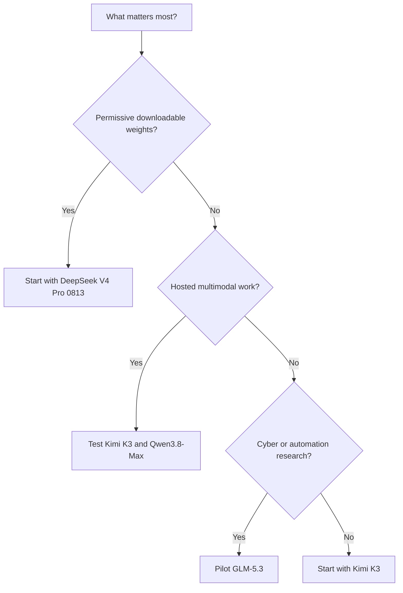

Four Chinese model families reached the frontier within weeks of one another. Their headline numbers look comparable; their products, licences, evaluation harnesses, and release states are not. This is a practical snapshot for deciding what to test, not a declaration of one universal winner.

<figure class="article-figure">
  
  <figcaption>Four model systems, one evaluation grid. Original AI-generated illustration.</figcaption>
</figure>

> **Evidence cutoff: 22 August 2026.** Model aliases, weights, prices, and leaderboards can change quickly. Links below point to the evidence used for this snapshot.

## Quick read

- **Overall test-first choice: Kimi K3.** It has the broadest combination of independent WebDev preference, shared-table wins, multimodality, long context, and downloadable weights. Its licence, price, and infrastructure needs can still make another model the better production choice.
- **Start with Kimi K3** when you want a downloadable, natively multimodal model with a 1M-token context and strong current coding-agent evidence, and can accept its custom licence and data-centre-scale deployment requirements.
- **Start with Qwen3.8-Max** when hosted multimodal work and web-development preference are most important. Treat the hosted Max service and the downloadable 2.4T-A95B checkpoint as related, but not identical, products.
- **Start with DeepSeek-V4-Pro-0813** when a permissively licensed checkpoint, flexible thinking mode, and an aggressively priced first-party API matter more than leading the current WebDev preference board.
- **Pilot GLM-5.3** for long-horizon coding and defensive security research. Its launch evidence is strong, but its weights were still pending at this cutoff, so an open-weight production decision would be premature.

That is deliberately a set of scenario choices. No single score covers quality, latency, tool reliability, licence obligations, safety, and operating cost.

## At-a-glance comparison

| Model snapshot | What is confirmed | Context and modality | Access at cutoff | Main operational caveat |
| --- | --- | --- | --- | --- |
| **GLM-5.3** | Same base as GLM-5.2; gains attributed to additional post-training | 1M context in the evaluated setup; text model; thinking always on with low/high/max effort | Hosted API and coding plan; weights promised two weeks after the 14 August launch | Weight files and final licence were not yet available to verify |
| **Kimi K3** | 2.8T total / 104B active MoE; native vision | 1,048,576 tokens; text and image model, with product-level video understanding | Chat, API, coding agent, and downloadable weights | Custom Kimi K3 licence; practical self-hosting requires substantial infrastructure |
| **DeepSeek-V4-Pro-0813** | 1.7T-class V4 Pro checkpoint; official 0813 service snapshot | 1M context; up to 384K output; thinking or non-thinking | Chat, API, and downloadable checkpoint | Vision is not part of the Pro text endpoint; verify the exact hosted alias and price before committing |
| **Qwen3.8-Max** | Hosted Max is based on the 2.4T-A95B family | Up to 1M context; hosted service supports text, image, and video input | QwenWork/Model Studio plus downloadable 2.4T-A95B weights | Hosted Max adds capabilities not present in the base downloadable checkpoint; custom licence |

The specifications come from the [GLM-5.3 launch](https://z.ai/blog/glm-5.3), [Kimi K3 model card](https://huggingface.co/moonshotai/Kimi-K3), [DeepSeek API documentation](https://api-docs.deepseek.com/quick_start/pricing/), [Alibaba announcement](https://www.alibabacloud.com/en/press-room/alibaba-unveils-qwen3-8-max), and [Qwen3.8 model card](https://huggingface.co/Qwen/Qwen3.8-2.4T-A95B). Parameter counts describe scale, not quality.

## What the comparable benchmark rows actually say

Z.ai's launch table is useful because it reports all four snapshots on several of the same named tests. It is still a **vendor-run comparison**, not an independent bake-off. Harnesses, reasoning effort, budgets, and missing cells matter.

Shaded cells mark the highest reported score in each row; "best" applies only to that benchmark and evaluation setup.

<table class="benchmark-table" aria-label="Vendor-reported benchmark comparison">
  <thead>
    <tr>
      <th scope="col">Benchmark</th>
      <th scope="col">GLM-5.3</th>
      <th scope="col">Kimi K3</th>
      <th scope="col">DeepSeek V4 Pro 0813</th>
      <th scope="col">Qwen3.8-Max</th>
    </tr>
  </thead>
  <tbody>
    <tr>
      <th scope="row">Terminal-Bench 2.1</th>
      <td>88.2</td>
      <td class="best-score"><strong>88.3</strong>Highest</td>
      <td>87.9</td>
      <td>86.6</td>
    </tr>
    <tr>
      <th scope="row">DeepSWE v1.1</th>
      <td>66.9</td>
      <td class="best-score"><strong>67.5</strong>Highest</td>
      <td>62.7</td>
      <td>56.6</td>
    </tr>
    <tr>
      <th scope="row">NL2Repo</th>
      <td>58.0</td>
      <td>58.0</td>
      <td class="best-score"><strong>61.1</strong>Highest</td>
      <td>55.9</td>
    </tr>
    <tr>
      <th scope="row">CyberGym</th>
      <td class="best-score"><strong>84.5</strong>Highest</td>
      <td>80.0</td>
      <td>83.3</td>
      <td>78.5</td>
    </tr>
    <tr>
      <th scope="row">Toolathlon Verified</th>
      <td>73.0</td>
      <td class="best-score"><strong>76.5</strong>Highest</td>
      <td>74.1</td>
      <td>72.5</td>
    </tr>
    <tr>
      <th scope="row">AutomationBench v1.0.6</th>
      <td class="best-score"><strong>48.2</strong>Highest</td>
      <td>46.7</td>
      <td>43.2</td>
      <td>39.8</td>
    </tr>
  </tbody>
</table>

There is no clean sweep. Kimi narrowly leads two coding rows and Toolathlon; DeepSeek leads repository-level code generation on NL2Repo; GLM leads the reported cyber and automation rows. Small numerical differences should not be mistaken for meaningful product differences without run variance and identical agent scaffolding.

GLM's most striking claim is the jump from GLM-5.2 to 5.3: Terminal-Bench 3.0 rises from 4.6 to 28.3 and DeepSWE v1.1 from 46.2 to 66.9. Z.ai attributes the improvement to scaled post-training rather than a new base model. That makes GLM-5.3 particularly interesting for long-horizon work, but it also means the launch post is evaluating its own new training recipe.

## An independent signal points in a different direction

The [Arena WebDev leaderboard](https://arena.ai/leaderboard/code) gives an independent user-preference signal. On 22 August, its snapshot showed:

| WebDev Arena snapshot | Rank | Score | Votes | Important qualifier |
| --- | ---: | ---: | ---: | --- |
| Kimi K3 Max | 2 | 1674 +11/-11 | 4,548 | Rank spread 1-4 |
| Qwen3.8-Max | 3 | 1669 +13/-13 | 3,210 | Preliminary; rank spread 2-4 |
| GLM-5.3 Max | 8 | 1597 +16/-16 | 1,734 | Rank spread 6-12 |
| DeepSeek V4 Pro High 0813 | 10 | 1582 +12/-12 | 2,706 | Rank spread 8-13 |

This favours Kimi and Qwen for this particular task, but it does not invalidate the vendor benchmark table. The two sources measure different things: executable benchmark completion versus human preference for web-development output. Arena's confidence intervals and rank spreads also warn against reading too much into adjacent positions. The [leaderboard changelog](https://arena.ai/company/leaderboard-changelog) shows how recently several models were added, so their ranks are still moving.

## Context and multimodality: 1M is not one feature

All four advertise or expose a million-token context in some form. That does not mean they have equal long-context reliability, latency, memory behaviour, or effective recall.

Kimi K3's 1M window is central to both its model card and API. It keeps thinking enabled and expects complete reasoning and tool-call history to be preserved across turns. That can help long-running agents, but an integration that discards assistant reasoning history may behave poorly.

DeepSeek's current API documentation is unusually explicit: V4 Pro supports thinking and non-thinking modes, a 1M context, and a maximum output of 384K. That control is useful when a routine task does not justify a long reasoning trace.

Qwen needs the most careful wording. The hosted Qwen3.8-Max service adds vision, non-thinking mode, built-in tools, and a default 1M context. The downloadable Qwen3.8-2.4T-A95B weights are not a byte-for-byte substitute for every hosted feature.

GLM-5.3 also makes thinking mandatory, with low, high, and max effort. Z.ai recommends max for coding. Teams migrating from a non-thinking GLM setup must change the request contract, not just the model name.

## Open weights are not the same as open source

| Model | Downloadable at cutoff? | Licence position | Practical meaning |
| --- | --- | --- | --- |
| GLM-5.3 | No | Not yet verifiable for 5.3 weights | Recheck when the promised files arrive; do not inherit assumptions from GLM-5.2 |
| Kimi K3 | Yes | Kimi K3 License | Broad reuse, with conditions that need legal review for some large commercial services |
| DeepSeek V4 Pro 0813 | Yes | MIT | Permissive checkpoint terms; hosted API terms remain separate |
| Qwen3.8-2.4T-A95B | Yes | Qwen3.8-Max custom licence | Downloadable, but not equivalent to an Apache/MIT release and not identical to hosted Max |

Even when weights are downloadable, these are enormous sparse models. Kimi K3 activates 104B parameters per token; Qwen's name itself records 95B active parameters. "Self-hostable" therefore means a serious multi-accelerator serving project, not a typical workstation deployment.

## Pricing: compare a workload, not a headline

The official Kimi API listed **$3 per million uncached input tokens and $15 per million output tokens**, with a much lower cache-hit input price. DeepSeek's first-party API page listed much lower direct prices for V4 Pro at this cutoff. Arena displayed different effective DeepSeek prices for the tested route, while GLM and Qwen pricing also varied by plan, region, and provider.

That discrepancy is the important lesson. Before choosing on price, cost the same trace for each model:

1. expected uncached input;
2. realistic cache-hit rate;
3. reasoning tokens and final output;
4. retries and failed tool calls;
5. concurrency and latency requirements; and
6. any agent, search, or sandbox fees.

A cheap token that causes another agent loop can be more expensive than a higher-priced successful run. Recheck each provider's live pricing page on the day of deployment.

## Safety and production fit

GLM-5.3's cyber results deserve attention. Z.ai reports 84.5 on CyberGym and says performance grew quickly on deeper exploitation tasks. That is valuable for defensive vulnerability research, but it also calls for stricter sandboxing, least-privilege credentials, network boundaries, audit logs, and human review. This article intentionally avoids operational exploit detail.

For every model, benchmark capability is only one production gate. Run a private evaluation that includes:

- repository-specific tasks with hidden tests;
- tool-call correctness and recovery from partial failure;
- prompt-injection and untrusted-content handling;
- data residency, retention, and service terms;
- latency and throughput under your concurrency; and
- a manual review of licence obligations for downloaded weights.

## Overall assessment

**Kimi K3 is the overall test-first winner in this August 2026 snapshot.** It combines the strongest independent WebDev signal among these four with three wins in the shared vendor-reported table, native multimodality, a 1M-token context, and downloadable weights. That makes it the broadest first candidate for a serious evaluation, but not an automatic production choice.

The caveat is substantial: Kimi's custom licence, comparatively high first-party token price, and demanding self-hosting footprint can outweigh its capability lead. GLM-5.3 is more compelling for the reported cyber and automation workloads, DeepSeek for permissive checkpoint terms and price-sensitive deployment, and hosted Qwen3.8-Max for multimodal web work. A private workload replay can therefore produce a different, more useful answer.

## Which model should you test first?

Use this as a first-pass route. Confirm the result with your own workload, cost, licence, and infrastructure constraints.

**For a coding-agent pilot:** begin with Kimi K3 and GLM-5.3, then keep DeepSeek as a cost-sensitive control. Kimi has the strongest current independent WebDev signal; GLM has the strongest improvement story in the vendor-run long-horizon suite.

**For multimodal knowledge work:** begin with Kimi K3 and hosted Qwen3.8-Max. Verify which abilities are native model features and which come from the surrounding product's tools.

**For downloadable weights with permissive terms:** DeepSeek is the clearest starting point at this cutoff. Kimi and Qwen are genuinely downloadable, but their custom licences need review. GLM-5.3 should be reconsidered only after its promised weights and licence are public.

**For production procurement:** do not select from this table alone. Freeze exact model IDs, replay your own task set, record success rate and total cost per successful task, and repeat after provider updates.

The models are not interchangeable. Each currently leads on a different decision axis. Keep those axes separate when choosing what to test.

---

### Sources

| External source | Used for | Important limitation |
| --- | --- | --- |
| [Z.ai: GLM-5.3 launch](https://z.ai/blog/glm-5.3) | GLM release details and the shared benchmark rows | Vendor announcement and vendor-run evaluation |
| [Moonshot AI: Kimi K3 model card](https://huggingface.co/moonshotai/Kimi-K3) | Architecture, context, modalities, weights, and licence | First-party model documentation |
| [DeepSeek API documentation](https://api-docs.deepseek.com/quick_start/pricing/) | Hosted modes, context, output limits, and observed pricing | Live service details can change |
| [Alibaba Cloud: Qwen3.8-Max announcement](https://www.alibabacloud.com/en/press-room/alibaba-unveils-qwen3-8-max) | Hosted Qwen capabilities and positioning | Vendor announcement |
| [Qwen3.8-2.4T-A95B model card](https://huggingface.co/Qwen/Qwen3.8-2.4T-A95B) | Downloadable checkpoint and hosted-versus-weights distinction | Hosted Max includes additional product capabilities |
| [Arena WebDev leaderboard](https://arena.ai/leaderboard/code) | Independent, dated web-development preference signal | Dynamic rankings with confidence intervals; not a general capability score |
