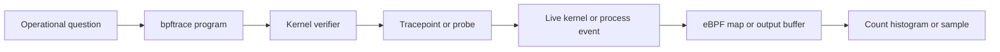

<p class="article-lead">eBPF can answer a live production question that ordinary logs never anticipated. With bpftrace, an operator can attach a short probe, collect only the needed evidence and remove it without rebuilding the application.</p>

## Quick read

- eBPF runs verified programs at selected kernel and user-space attachment points.
- bpftrace provides a compact language for tracing without writing a full eBPF application.
- Start with stable tracepoints and narrow filters. Avoid attaching broad probes indefinitely.
- Aggregated counts and histograms usually cost less and expose less sensitive data than printing every event.
- Kernel support, BTF information, privileges and available probes differ between systems.
- Verification reduces risk but does not make every tracing program free or operationally harmless.

## The observation path



The verifier checks properties such as valid memory access and bounded execution before the program can load. The attachment point then runs the program when its event occurs. Maps retain counters, histograms or keyed state that user space can read.

## Choose the least fragile probe

| Probe type | Attaches to | Good first use | Caveat |
| --- | --- | --- | --- |
| Tracepoint | Explicit kernel trace event | System calls, scheduling and block I/O | Available fields depend on the tracepoint |
| Kprobe or kretprobe | Kernel function entry or return | Kernel detail without a tracepoint | Function names and internals can change between kernels |
| Uprobe or uretprobe | User-space function | Library or application functions | Symbols, inlining and binary versions matter |
| USDT | Application-defined static probe | Stable semantic application events | Application must expose the probe |
| Software or hardware profile | Timer or performance counter | CPU stack sampling | Frequency and stack collection affect overhead |

Prefer a tracepoint when it already exposes the event you need. It is an intentional tracing interface. A kprobe can reach deeper but depends more heavily on implementation detail.

## Discover before attaching

List available system-call entry tracepoints:

```bash
sudo bpftrace -l 'tracepoint:syscalls:sys_enter_*'
```

Inspect one tracepoint's fields:

```bash
sudo bpftrace -lv 'tracepoint:syscalls:sys_enter_openat'
```

Do not copy a script that assumes field names your kernel does not expose. `-lv` shows the arguments available on the running system.

## Count file opens by process

This probe counts `openat` calls and prints the map when interrupted with Ctrl-C:

```bash
sudo bpftrace -e '
tracepoint:syscalls:sys_enter_openat
{
  @[comm] = count();
}'
```

It answers "which command names are opening files most often?" It does not show how many descriptors remain open. Calls may succeed or fail, and multiple processes can share the same `comm` value.

Narrow the question to one process ID:

```bash
sudo bpftrace -e '
tracepoint:syscalls:sys_enter_openat
/pid == 12345/
{
  @[str(args.filename)] = count();
}'
```

Replace `12345` with a validated PID. Copying every pathname has more cost and privacy exposure than counting process names, so use the narrower probe only for the time needed.

## Count failed opens

An exit tracepoint exposes the return value. Negative values represent errors:

```bash
sudo bpftrace -e '
tracepoint:syscalls:sys_exit_openat
/args.ret < 0/
{
  @[comm, args.ret] = count();
}'
```

This quickly separates an application doing normal opens from one repeatedly failing. The number is a negative Linux error value. Resolve it against the running system's errno definitions before assigning a cause.

## Observe process execution

```bash
sudo bpftrace -e '
tracepoint:syscalls:sys_enter_execve
{
  printf("%-16s pid=%d file=%s\n", comm, pid, str(args.filename));
}'
```

This can reveal a service launching an unexpected helper in a loop. It can also expose sensitive path or command information. Restrict collection, retention and access, especially on shared hosts.

## Build a latency histogram

Entry and exit probes can be correlated by thread ID. This example measures `read` system-call duration in microseconds:

```text
tracepoint:syscalls:sys_enter_read
{
  @started[tid] = nsecs;
}

tracepoint:syscalls:sys_exit_read
/@started[tid]/
{
  @read_us = hist((nsecs - @started[tid]) / 1000);
  delete(@started[tid]);
}
```

Save it as `read-latency.bt`, then run:

```bash
sudo bpftrace read-latency.bt
```

The histogram shows the distribution instead of printing one line per call. That is usually more useful during an incident. It still combines cached reads, terminals, sockets and files unless you add a careful process or descriptor filter.

## Ask a precise question

Broad tracing produces impressive output and weak evidence. Convert the incident into a bounded query.

| Weak question | Better bpftrace question |
| --- | --- |
| Why is the host slow? | Which processes have `read` calls above 10 ms during the next 30 seconds? |
| What is this service doing? | Which paths does PID 12345 fail to open? |
| Is networking broken? | Which process receives failed `connect` returns for this destination family? |
| Why is CPU high? | Which user and kernel stacks are on CPU for this cgroup during a 20-second sample? |
| Why are jobs delayed? | What is the scheduler run-queue delay distribution for these worker threads? |

The narrower form defines a population, event, measurement and observation window. It is easier to validate and safer to run.

## Production safety checklist

Before attaching a probe:

1. Confirm the probe exists and inspect its fields.
2. Filter by PID, cgroup, command or event condition where possible.
3. Prefer counts and histograms over per-event printing.
4. Set a short observation window and a clear stop condition.
5. Avoid copying request bodies, credentials or arbitrary user strings.
6. Watch CPU use and dropped-event indicators from the tracing tool.
7. Record kernel, bpftrace and script versions with the result.
8. Reproduce on a lower-risk host before using fragile kprobes or uprobes.

Do not paste unknown privileged tracing programs into a production host. eBPF safety depends on the loaded program, attachment frequency, kernel and permissions.

## When bpftrace is the wrong tool

| Need | Better starting point |
| --- | --- |
| Long-term service-level metrics | Application instrumentation or OpenTelemetry |
| Historical request evidence | Structured application logs and traces |
| One process's system-call sequence in a test environment | `strace` |
| Packet payload and protocol analysis | `tcpdump` or an appropriate protocol tool |
| Repeatable fleet-wide observability product | Maintained eBPF agent with controlled rollout |

bpftrace is strongest for a focused live question. Evidence that must survive the incident should move into ordinary supported telemetry after the cause is understood.

## Important references

| Reference | Use |
| --- | --- |
| [Linux BPF documentation](https://docs.kernel.org/bpf/) | Kernel eBPF concepts and interfaces |
| [bpftrace hands-on lab](https://bpftrace.org/hol/intro) | Guided tracing exercises |
| [bpftrace system-call lab](https://bpftrace.org/hol/system-calls) | Tracepoint arguments and examples |
| [bpftrace one-liner tutorial](https://bpftrace.org/tutorial-one-liners) | Focused diagnostic patterns |
| [Linux tracing index](https://docs.kernel.org/trace/index.html) | Kernel tracing infrastructure |
