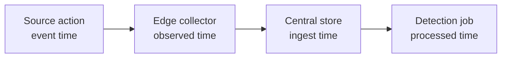

<p class="article-lead">A security event can have several correct timestamps. The mistake is collapsing them into one field and then treating search order as a faithful reconstruction of what happened.</p>

## Quick read

- Preserve source event time, first-observed time and central ingest time separately.
- Use an RFC3339 timestamp with an explicit offset; normalize to UTC for comparison.
- Do not overwrite a missing or invalid source time with ingest time without recording that substitution.
- Clock skew and pipeline delay are different measurements.
- Use sequence numbers or causal identifiers when strict order matters.

## A useful timestamp model

| Field | Meaning | Clock owner |
| --- | --- | --- |
| `event.time` | When the source says the activity occurred | Source host or device |
| `observed.time` | When the first collector observed it | Edge collector |
| `ingested.time` | When the central store accepted it | SIEM or data platform |
| `processed.time` | When enrichment or detection completed | Processing stage |

Elastic Common Schema normally uses `@timestamp` for the original event time, `event.created` for first pipeline observation and `event.ingested` for arrival in the central store. OpenTelemetry uses `Timestamp` and `ObservedTimestamp` for the first two concepts.



## Use a constrained wire format

[RFC 3339](https://datatracker.ietf.org/doc/html/rfc3339) is a practical Internet profile of ISO 8601. A timestamp should carry an offset:

```text
2026-09-01T09:42:17.381Z
2026-09-01T10:42:17.381+01:00
```

Both identify an instant. The first is easier to compare. Preserve an original zone field when the local civil time matters to an investigation.

Avoid these forms in machine events:

```text
09/01/26 09:42
Sep 1 09:42:17
2026-09-01 09:42:17
```

They omit an offset, may be locale-dependent and can be ambiguous around daylight-saving changes. Legacy syslog timestamps also omit the year and zone, forcing a collector to infer context.

## Two calculations, two meanings

Pipeline latency is approximately:

```text
ingest_delay = ingested.time - observed.time
```

Clock difference plus pre-collector delay is approximately:

```text
source_delta = observed.time - event.time
```

A large `ingest_delay` indicates buffering, network or central-platform delay. A negative or unusually large `source_delta` may indicate source clock skew, a badly parsed timezone, delayed application logging or a legitimately old event being replayed.

Do not automatically adjust every source timestamp to make it match arrival. Store the raw value, parsed value, parse result and any correction rule.

## Ordering is not causality

Suppose service A sends a request to service B:

| Record | Source timestamp |
| --- | --- |
| A sends request | 10:00:00.300 |
| B receives request | 10:00:00.120 |

The clocks differ by more than the network latency, so sorting implies that B received the request before A sent it. A shared trace ID and parent-child span relationship preserves causality even when wall clocks are imperfect.

For a single producer, include a monotonic sequence number where gaps matter. Wall-clock timestamps can move backwards after synchronization or administrative change. Monotonic clocks are useful for durations inside one process, but they cannot directly establish absolute time across hosts.

## Late events change analytics

Streaming systems distinguish event time from processing time because events arrive late and out of order. A five-minute detection window evaluated only at arrival time may miss an event buffered for six minutes.

Define:

- the event-time window;
- an allowed lateness or watermark;
- whether late events reopen a result;
- retention for reprocessing; and
- which detections require immediate arrival rather than historical completeness.

For incident response, dashboards can show the event-time timeline while a separate ingest-delay chart explains why an alert was late.

## A robust normalized record

```json
{
  "@timestamp": "2026-09-01T09:42:17.381Z",
  "event": {
    "created": "2026-09-01T09:42:18.004Z",
    "ingested": "2026-09-01T09:42:21.902Z",
    "sequence": 884102,
    "timezone": "+01:00"
  },
  "trace": { "id": "4bf92f3577b34da6a3ce929d0e0e4736" },
  "log": { "original": "..." },
  "tags": ["source-time-valid"]
}
```

Keep parsing status explicit. An invalid source timestamp should not silently become a plausible central timestamp.

## Operational checks

Monitor distributions rather than one average:

- `ingested - created` by source and collector;
- `created - event time` by host model or firmware;
- invalid timestamp count;
- future-dated event count;
- late-event percentage; and
- NTP or time-service offset.

Alert on a change from each source's baseline. Some batch systems are intentionally delayed, while an authentication stream normally is not.

## Sources and further reading

| External source | Purpose |
| --- | --- |
| [RFC 3339](https://datatracker.ietf.org/doc/html/rfc3339) | Interoperable Internet timestamp syntax |
| [ECS implementation patterns](https://www.elastic.co/docs/reference/ecs/ecs-principles-implementation) | `@timestamp`, `event.created` and `event.ingested` ordering |
| [ECS event fields](https://www.elastic.co/docs/reference/ecs/ecs-event) | Event timestamp and sequence semantics |
| [OpenTelemetry Logs Data Model](https://opentelemetry.io/docs/specs/otel/logs/data-model/) | `Timestamp` and `ObservedTimestamp` |

