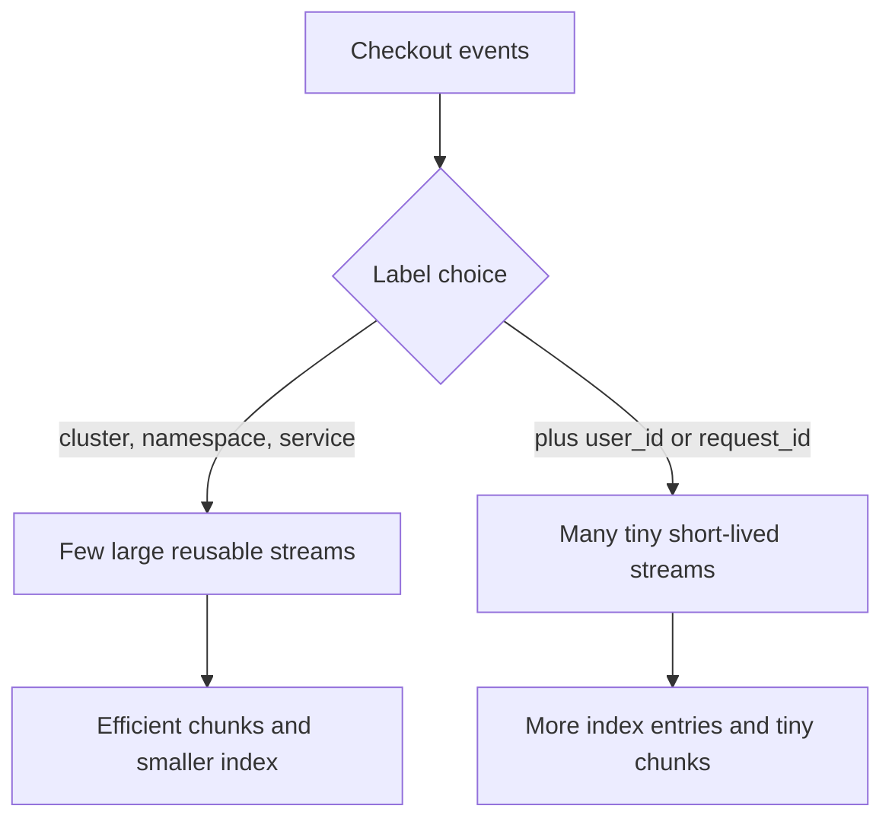

<p class="article-lead">High cardinality is not simply having many events. It is allowing an unbounded value or field name to change the storage structure used to index them.</p>

## Quick read

- In Loki, every unique label set creates a log stream. Request IDs, user IDs and ephemeral pod names can create huge numbers of tiny streams.
- In Elasticsearch, dynamic object keys can create one mapped field per key and exhaust field limits.
- Keep stable bounded dimensions in indexed labels or fields.
- Store high-cardinality values as log content, structured metadata, keywords or a bounded flattened object according to the platform.
- Monitor cardinality and field growth before queries slow down or ingestion rejects events.

## Two different explosions

| Platform | Indexed structure that grows | Common mistake |
| --- | --- | --- |
| Loki | Unique stream label sets | `request_id` or `user_id` used as a label |
| Elasticsearch | Mapped field names and field structures | User-controlled keys expanded by dynamic mapping |

The remedies differ because Loki indexes label sets while Elasticsearch indexes document fields and terms.

## Loki stream cardinality

A Loki stream is identified by its complete label set. Suppose these labels are used:

```text
{cluster="prod", namespace="shop", service="checkout", user_id="u-817291"}
```

`cluster`, `namespace` and `service` have bounded reusable values. `user_id` may have millions. Every new combination produces another stream.



Better Loki representation:

```text
labels: {cluster="prod", namespace="shop", service="checkout"}
structured metadata: {user_id="u-817291", trace_id="4bf92f..."}
line: "payment authorization failed"
```

Grafana recommends low-cardinality labels for stable source identity and structured metadata for high-cardinality values that still need filtering. Structured metadata is not free: it counts toward ingestion limits and has size/count limits.

## Combinations multiply

Cardinality is the number of distinct label sets, not the sum of distinct values. In a worst-case independent combination:

```text
streams <= environments * regions * services * instances * users
```

Ten environments, five regions, 200 services and 100 instances already permit one million combinations before a user label is added. Real combinations are constrained, but the multiplication explains why one unbounded label is dangerous.

## Elasticsearch mapping explosion

This event is safe because user IDs are values of one mapped field:

```json
{
  "user": { "id": "u-817291" },
  "event": { "action": "login" }
}
```

This shape is dangerous with dynamic mapping because each user ID becomes a field name:

```json
{
  "metrics_by_user": {
    "u-817291": 12,
    "u-552104": 3,
    "u-992118": 18
  }
}
```

As new users arrive, the mapping grows. Elasticsearch counts object mappings, field mappings, aliases and mapped runtime fields toward `index.mapping.total_fields.limit`, whose documented default is 1000. Raising the limit treats the symptom and can increase memory and query costs.

Safer shapes include an array of fixed objects:

```json
{
  "metrics_by_user": [
    { "user_id": "u-817291", "count": 12 },
    { "user_id": "u-552104", "count": 3 }
  ]
}
```

The correct mapping may be `object`, `nested` or a separate index depending on query semantics. If arbitrary keys must be retained and only simple key lookup is required, the `flattened` type can contain them without one mapping per key. It has different query capabilities, so test actual searches.

## Dynamic mapping needs a boundary

Useful options include:

| Policy | Result |
| --- | --- |
| `dynamic: true` | Add new mapped fields until limits are reached |
| `dynamic: false` | Keep unknown fields in `_source` on ordinary indices but do not map them |
| `dynamic: strict` | Reject documents containing unknown fields |
| Dynamic templates | Map known name patterns to controlled types |
| `flattened` field | Store an arbitrary key-value object under one mapping |

Use strict or false boundaries around untrusted or vendor-extension objects. Keep a dead-letter or failure path so a newly rejected field is visible rather than silently lost.

## Find the problem early

For Loki, track:

- active streams per tenant;
- streams created per second;
- chunk size and utilization;
- top label names and value counts;
- ingestion rejection counters; and
- query fan-out and bytes scanned.

For Elasticsearch, track:

- mapped field count per index and data view;
- mapping update rate;
- rejected documents at the total-fields limit;
- cluster-manager heap and mapping-related task time;
- field-capabilities response size; and
- unexpected new fields by source integration.

## A schema review question

For every candidate field, ask two separate questions:

1. Does this value need to be retained?
2. Does this value need to change the index structure?

The first answer is often yes while the second is no. A trace ID is highly useful to retain and search, but it usually should not define a Loki stream. A vendor attribute may be worth preserving in `_source` or a flattened object without becoming a new top-level Elasticsearch field.

## Sources and further reading

| External source | Purpose |
| --- | --- |
| [Loki label guidance](https://grafana.com/docs/loki/latest/get-started/labels/) | Stream cardinality and low-cardinality labels |
| [Loki structured metadata](https://grafana.com/docs/loki/latest/get-started/labels/structured-metadata/) | Non-indexed high-cardinality metadata |
| [Elasticsearch mapping explosion](https://www.elastic.co/guide/en/elasticsearch/reference/current/mapping-explosion.html) | Symptoms, diagnosis and mitigation |
| [Mapping limit settings](https://www.elastic.co/docs/reference/elasticsearch/index-settings/mapping-limit) | Field-count limits and consequences |
| [Dynamic mapping](https://www.elastic.co/docs/reference/elasticsearch/mapping-reference/dynamic) | `true`, `false`, `strict` and runtime behaviour |

