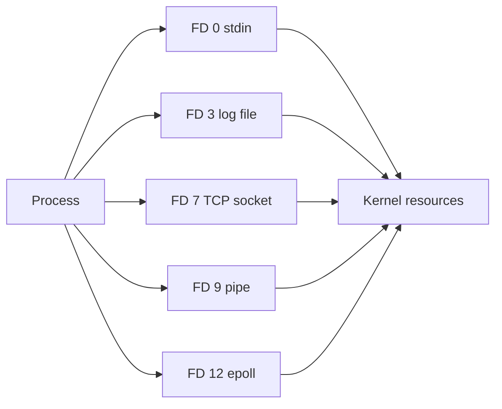

<p class="article-lead">"Too many open files" usually means one process reached its file-descriptor limit. Raising that limit may restore service, but it can also give a leak more time to consume memory, sockets and downstream capacity.</p>

## Quick read

- Linux represents regular files, sockets, pipes, event queues and many other resources with file descriptors.
- `EMFILE` means the process reached its descriptor limit. `ENFILE` means the system-wide open-file limit was reached.
- Count descriptors in `/proc/PID/fd`, then classify what is growing.
- Compare the process's active limit with the service-manager configuration.
- A high stable count may be legitimate. Continuous unbounded growth is the stronger leak signal.
- Increase a limit only after measuring workload demand and checking why descriptors remain open.

## One integer can represent many resources

A file descriptor is a non-negative integer in a process's descriptor table. By convention, descriptors 0, 1 and 2 are standard input, output and error. Later values may refer to files, sockets, pipes, `eventfd`, `epoll`, `inotify` or other kernel objects.



Closing a descriptor removes that process-table entry. The underlying open-file description remains while another descriptor still references it. That distinction explains why duplicated descriptors and inherited descriptors can keep resources alive.

## Confirm which limit failed

The application log may show only a generic message. The underlying error matters:

| Error | Meaning | Investigation scope |
| --- | --- | --- |
| `EMFILE` | This process reached `RLIMIT_NOFILE` | Process count, service limit and leak |
| `ENFILE` | System-wide open-file table limit reached | Host-wide usage and `/proc/sys/fs/file-nr` |

The [`getrlimit` manual](https://man7.org/linux/man-pages/man2/getrlimit.2.html) defines `RLIMIT_NOFILE` as one greater than the largest descriptor number the process may open.

Find the process and validate the PID before using it:

```bash
pid=$(pgrep -n my-service) || exit 1
test -n "$pid" || exit 1
printf 'PID=%s\n' "$pid"
cat /proc/"$pid"/limits | grep -i 'open files'
ls -1 /proc/"$pid"/fd | wc -l
```

The count and limit are not expected to be identical at failure time. Descriptors can close before inspection, the failed open did not create a new entry, and monitoring tools introduce timing differences.

## Measure growth instead of taking one snapshot

A busy proxy with 20,000 stable connections may be healthy. A quiet worker gaining 100 descriptors every minute is suspicious.

```bash
watch -n 2 'ls -1 /proc/12345/fd 2>/dev/null | wc -l'
```

Replace `12345` with the validated PID. Record the count beside request rate, queue depth and connection count. If descriptors rise with traffic and fall when work completes, the pool may be operating normally. If the baseline rises after every traffic cycle, something is not being released.

## Classify the descriptors

Start with the symbolic links exposed by `/proc`:

```bash
ls -l /proc/"$pid"/fd | sed -n '1,80p'
```

Typical targets include:

```text
/var/log/my-service.log
socket:[284921]
pipe:[284117]
anon_inode:[eventpoll]
/tmp/export.csv (deleted)
```

For a summarized view, `lsof` is convenient:

```bash
sudo lsof -nP -p "$pid"
sudo lsof -nP -p "$pid" | awk 'NR > 1 {count[$5]++} END {for (type in count) print type, count[type]}' | sort
```

`lsof` type labels vary by platform and version. Use the summary to choose a direction, then inspect the actual entries.

| Dominant entry | Likely questions |
| --- | --- |
| TCP sockets | Is a client connection pool bounded? Are connections stuck in `CLOSE_WAIT`? |
| Regular files | Are files opened per request and not closed on error paths? |
| `(deleted)` files | Did log rotation unlink a file that the process still holds open? |
| Pipes | Did child processes exit, or are producer and consumer ends retained? |
| `inotify` | Are directory watches recreated without removing old watches? |
| `eventpoll` | Is an event loop or worker created repeatedly? |

## Inspect network states

For a network service, count socket states before blaming the descriptor limit:

```bash
sudo ss -tanp
sudo ss -tanp | awk 'NR > 1 {state[$1]++} END {for (s in state) print s, state[s]}' | sort
```

Interpret states carefully:

| State | Possible meaning |
| --- | --- |
| `ESTAB` | Active or pooled connection; check whether the count matches load |
| `CLOSE-WAIT` | Peer closed, but the local application has not closed its side |
| `TIME-WAIT` | Local TCP endpoint closed normally; usually not an application FD leak because the process descriptor is already closed |
| `SYN-SENT` | Outbound connection attempts are waiting; check destination and timeout policy |
| `LISTEN` | Server listening socket; normally a small stable set |

Large `TIME-WAIT` output is a network-capacity clue, not proof that one process still holds those sockets open.

## Deleted files can consume disk silently

A process can continue writing to an unlinked file through its open descriptor. The path disappears from an ordinary directory listing, but disk blocks remain allocated until the last reference closes.

```bash
sudo lsof +L1
```

If a large deleted log belongs to a service, use the service's documented reopen or reload mechanism. Restart only when its availability policy permits it. Do not truncate arbitrary `/proc/PID/fd/N` entries without understanding what the process expects.

## Find the effective service limit

A shell and a systemd service can receive different limits.

```bash
ulimit -Sn
ulimit -Hn
systemctl show my-service.service -p LimitNOFILE
cat /proc/"$pid"/limits | grep -i 'open files'
```

The `/proc` value is the effective truth for the running process. Changing a unit file does not retroactively change an existing process unless the service is reloaded or restarted through an appropriate procedure.

If measurement shows that the legitimate working set exceeds the configured limit, a systemd override may be appropriate:

```ini
[Service]
LimitNOFILE=65536
```

The number is an example, not a universal recommendation. Size it from concurrent connections, open files, pipes, watchers, worker count and safety margin. Check application and kernel memory costs as well as downstream limits.

## Do not fix only the ceiling

Use this order:

1. Identify `EMFILE` or `ENFILE`.
2. Confirm the PID, effective limit and current descriptor count.
3. Measure the count over time and against traffic.
4. Classify files, sockets, pipes and anonymous descriptors.
5. Find the application path or pool that retains them.
6. Correct lifecycle handling, timeouts or pool bounds.
7. Raise the limit only when the measured legitimate peak requires it.
8. Alert on both absolute utilization and sustained growth.

A useful alert includes the process start time. A count that resets after every automatic restart can hide a slow leak.

## Important references

| Reference | Use |
| --- | --- |
| [`getrlimit(2)`](https://man7.org/linux/man-pages/man2/getrlimit.2.html) | Per-process descriptor limits and `EMFILE` |
| [`proc_pid_fd(5)`](https://man7.org/linux/man-pages/man5/proc_pid_fd.5.html) | Descriptor inspection through `/proc/PID/fd` |
| [`proc_sys_fs(5)`](https://man7.org/linux/man-pages/man5/proc_sys_fs.5.html) | Host file-handle counters and limits |
| [`systemd.exec`](https://www.freedesktop.org/software/systemd/man/latest/systemd.exec.html) | `LimitNOFILE` service configuration |
| [`ss(8)`](https://man7.org/linux/man-pages/man8/ss.8.html) | Socket state inspection |

