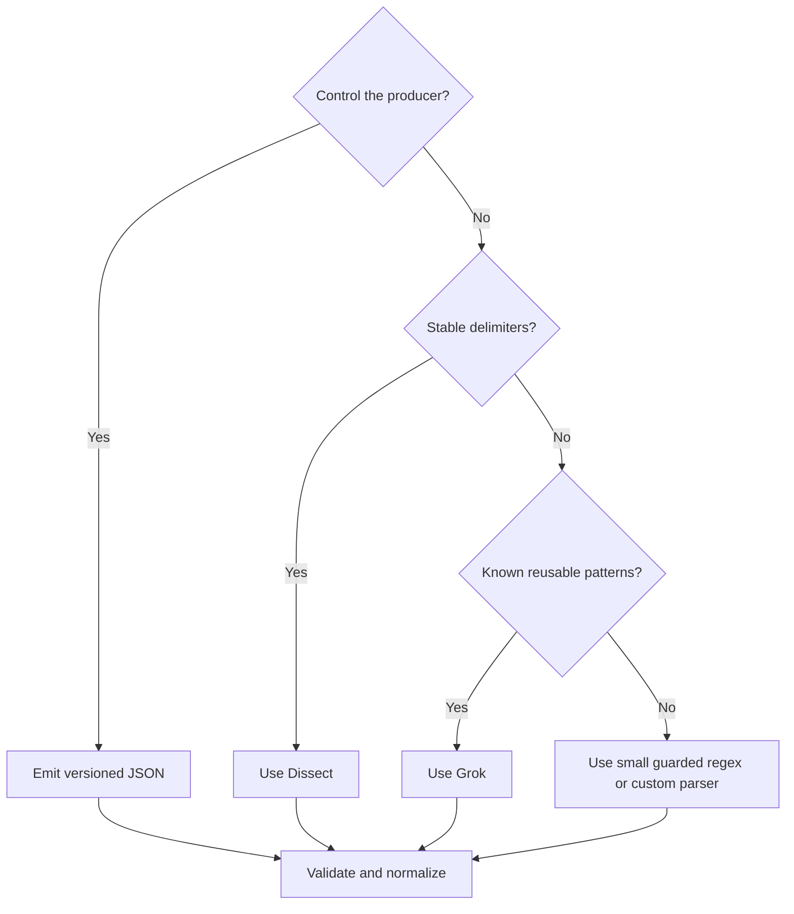

<p class="article-lead">The cheapest parser is the one the application no longer needs. If you control the producer, emit a stable structured event. Use Dissect for stable delimiters and Grok only where the text genuinely varies.</p>

## Quick read

- Prefer one JSON object per event when you control the producer.
- Dissect is fast and predictable for fixed delimiter layouts.
- Grok handles variable human-oriented text through named regular-expression patterns.
- Keep the original message and route parse failures to a visible path.
- Parsing is not normalization. Extracted fields still need types and stable semantics.

## Decision path



## Start with an event contract

A useful application event is more than JSON syntax.

```json
{
  "schema_version": 1,
  "timestamp": "2026-09-01T09:50:13.402Z",
  "level": "INFO",
  "event_name": "http_request_completed",
  "service": "checkout-api",
  "request_id": "req-8f91",
  "method": "POST",
  "path": "/orders",
  "status_code": 201,
  "duration_ms": 84
}
```

Use native JSON numbers and booleans rather than quoting everything. Keep `event_name` stable even if the human message changes. Do not serialize an exception stack trace as several independent top-level events unless the transport defines multiline framing.

NDJSON, one JSON object followed by LF, is convenient for files and streams. A pretty-printed multiline JSON object needs an explicit multiline collector rule and raises memory limits.

## Dissect for stable delimiters

Input:

```text
2026-09-01T09:50:13Z INFO 10.0.2.15 POST /orders 201 84
```

Logstash filter:

```text
dissect {
  mapping => {
    "message" => "%{event_time} %{log_level} %{source_ip} %{http_method} %{url_path} %{status_code} %{duration_ms}"
  }
  convert_datatype => {
    "status_code" => "int"
    "duration_ms" => "int"
  }
}
```

Dissect walks delimiters rather than evaluating a regular expression. It is a good fit when every field is present in the same order. A missing token normally causes the dissection to fail, which is safer than silently shifting values into the wrong columns.

## Grok for variable text

Input:

```text
Sep  1 09:50:13 edge01 sshd[4912]: Failed password for invalid user test from 192.0.2.40 port 55231 ssh2
```

```text
grok {
  match => {
    "message" => "%{SYSLOGTIMESTAMP:syslog_timestamp} %{HOSTNAME:host_name} %{DATA:process.name}\[%{POSINT:process.pid:int}\]: %{GREEDYDATA:event.original_message}"
  }
  tag_on_failure => ["_grok_failure_ssh"]
  timeout_scope => "event"
}
```

The first Grok stage should extract the stable envelope. A second, event-specific stage can parse the SSH message. Avoid one enormous expression containing every possible variant.

## Guard regular expressions

Backtracking expressions can consume excessive CPU on unexpected input. Practical controls include:

- anchor with `^` and `$` when the entire line is expected;
- use a cheap substring or event-code test before regex;
- avoid nested ambiguous repetitions;
- cap input length;
- configure timeouts where supported; and
- keep a sample set of malformed and adversarial lines.

Parsing untrusted logs is part of the ingestion attack surface.

## Hybrid parsing is often best

If the prefix is stable but the message varies, use Dissect for the prefix and Grok for the remaining field. This reduces the amount of text evaluated by regex and makes failures easier to locate.

```text
dissect {
  mapping => { "message" => "%{ts} %{level} %{host} %{program}: %{detail}" }
}
grok {
  match => { "detail" => "user=%{USERNAME:user.name} action=%{WORD:event.action}( reason=%{GREEDYDATA:event.reason})?" }
}
```

## A failure path is mandatory

Never drop a parsing failure without a counter and retrievable sample.

| Output | Contents | Retention |
| --- | --- | --- |
| Normal stream | Parsed and validated events | Normal policy |
| Failure stream | Original line, source, parser version and error tag | Short controlled retention |
| Metrics | Success, failure, latency and unknown-version counts | Monitoring policy |

Redact secrets before retaining failure samples. A parser failure can expose the raw token that the successful path would have removed.

## Test the schema, not only the pattern

A parser test should assert:

- correct types, not just field presence;
- timezone handling;
- optional and missing fields;
- maximum line and stack-trace size;
- field names after normalization;
- no unexpected dynamic fields; and
- representative failure tagging.

Version parser configurations with test fixtures. A vendor firmware update that changes one delimiter should fail in CI or a canary pipeline before it corrupts production fields.

## Sources and further reading

| External source | Purpose |
| --- | --- |
| [Logstash Grok filter](https://www.elastic.co/docs/reference/logstash/plugins/plugins-filters-grok) | Grok syntax, types, timeouts and Grok-vs-Dissect guidance |
| [Logstash Dissect filter](https://www.elastic.co/guide/en/logstash/current/plugins-filters-dissect.html) | Delimiter parsing and failure behaviour |
| [Logstash pipeline model](https://www.elastic.co/docs/reference/logstash/how-logstash-works) | Inputs, filters, codecs and outputs |
| [ECS getting started](https://www.elastic.co/docs/reference/ecs/ecs-getting-started) | Mapping extracted values to consistent fields |

