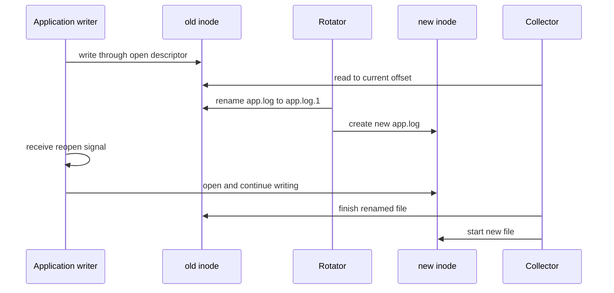

<p class="article-lead">A pathname is not an open file. On Unix-like systems, a process writes through a file descriptor to an inode. Understanding that one fact explains most missing or duplicated events during log rotation.</p>

## Quick read

- Prefer rename-create rotation when the application can reopen its log after a signal or API call.
- `copytruncate` has an unavoidable interval in which newly written bytes can be lost.
- A collector needs stable file identity and must include rotated names long enough to reach EOF.
- Path-only tracking is fragile because a pathname can refer to a different file after rotation.
- Test rotation under continuous writes and verify a sequence number, not only file sizes.

## Path, descriptor and inode



Renaming a file changes a directory entry. It does not invalidate descriptors already open on the inode. If the application is never told to reopen, it continues writing to `app.log.1` while the new `app.log` remains empty.

## Rename-create is normally safer

```text
/var/log/myapp/app.log {
    daily
    rotate 14
    missingok
    notifempty
    compress
    delaycompress
    create 0640 myapp adm
    sharedscripts
    postrotate
        /bin/kill -HUP "$(cat /run/myapp.pid)" 2>/dev/null || true
    endscript
}
```

This example assumes the application documents `SIGHUP` as a safe reopen request. Do not guess a signal. Some programs reload all configuration, terminate or ignore it.

`delaycompress` leaves the most recent rotated file uncompressed for one cycle. That can help a writer or collector that still has the old file open. Modern collectors may support compressed rotated files, but a live writer must never continue writing into a gzip file.

## Why `copytruncate` can lose data

`copytruncate` performs two distinct operations:

1. Copy the current file to a rotated name.
2. Truncate the original inode to zero.

If the application writes between those operations, the new bytes may be after the copied endpoint and then removed by truncation. The logrotate manual explicitly documents this small loss window.

```text
copy starts          copy ends       truncate
|------------------------|---------------|
                         ^ writes here can disappear
```

It is useful only when the application cannot reopen its file and the accepted loss risk is documented. Faster disks reduce the window but do not make the operation atomic.

## The collector needs a file identity

A tailing collector stores an identity and an offset. Common identities include:

| Identity | Advantage | Failure mode |
| --- | --- | --- |
| Path | Simple | Path now refers to a new inode after rotation |
| Device plus inode | Stable across rename on one filesystem | Inodes can eventually be reused; network filesystems can differ |
| Content fingerprint | Can follow content across rename or copy | Needs enough initial bytes and correct migration settings |

Recent Filebeat `filestream` uses fingerprint identity by default. Elastic warns that changing identity settings can duplicate events and recommends matching active and rotated files. For example:

```yaml
filebeat.inputs:
  - type: filestream
    id: myapp
    paths:
      - /var/log/myapp/app.log*
```

Do not exclude `app.log.1` immediately after rotation. The collector may still need unread bytes from it. Conversely, retaining and rediscovering a rotated file without stable identity can replay it.

## Rotation and deletion are different deadlines

A collector must reach EOF before retention removes the inode. Calculate the worst case from peak write rate, maximum collector outage and rotation frequency.

If a collector can be offline for 48 hours but rotated files are deleted after 24 hours, no file-identity algorithm can recover the missing day. Retention is part of the delivery service level.

## A repeatable test

Generate numbered lines continuously:

```bash
i=1
while [ "$i" -le 200000 ]; do
  printf '%09d test-event\n' "$i"
  i=$((i + 1))
done
```

Route the output through the real application logging path, force rotation several times, restart the collector once and then extract the sequence at the destination.

Check:

- missing numbers;
- repeated numbers;
- ordering changes;
- lines split at rotation;
- the time required to finish old files; and
- registry or checkpoint state before and after restart.

A count alone is insufficient because one missing event and one duplicate preserve the total.

## Container logs need the same reasoning

Container runtimes rotate files, while agents discover symlinks and changing pod paths. The names are different, but identity, offset, retention and race conditions remain. Prefer the runtime-supported logging path rather than adding a second uncoordinated rotator to container log files.

## Sources and further reading

| External source | Purpose |
| --- | --- |
| [logrotate configuration manual](https://man7.org/linux/man-pages/man5/logrotate.conf.5.html) | Rotation directives and the `copytruncate` loss warning |
| [Filebeat rotation guidance](https://www.elastic.co/docs/reference/beats/filebeat/file-log-rotation) | Lost and duplicated event scenarios |
| [Filebeat file identity](https://www.elastic.co/docs/reference/beats/filebeat/file-identity) | Fingerprint, native and path identity trade-offs |

