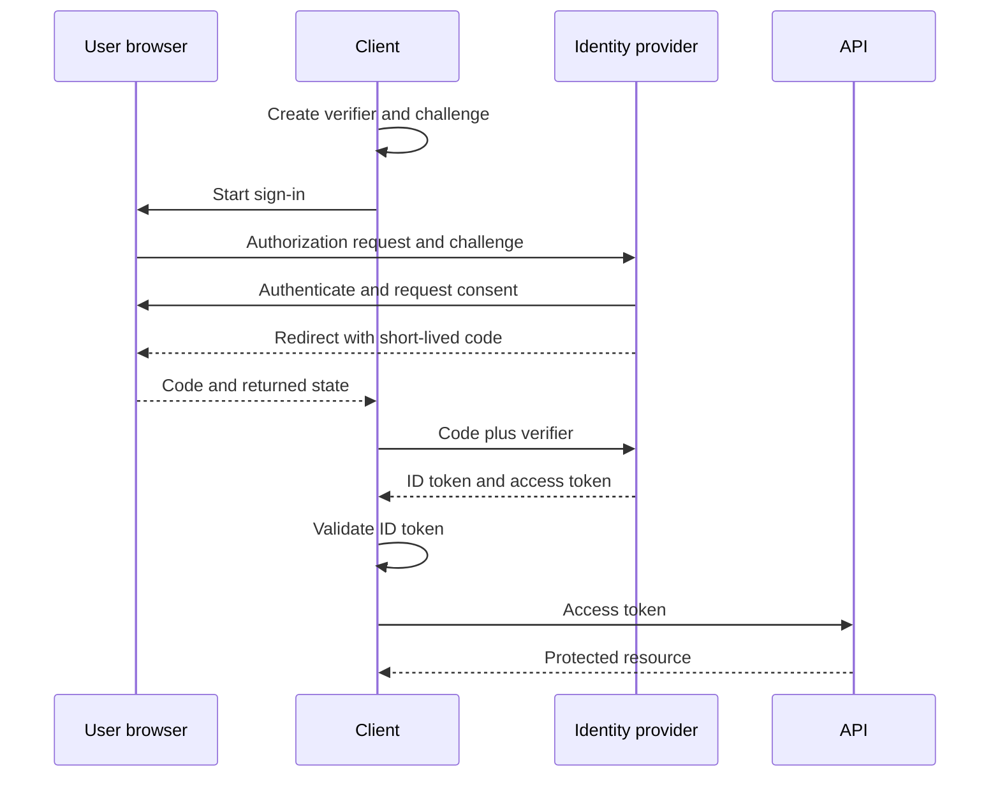

<p class="article-lead">OAuth delegates access to an API. OpenID Connect adds a login and identity layer. JWT is a token format that either system may use. Treating the three names as synonyms creates security bugs.</p>

## Quick read

- OAuth answers whether a client may access a protected resource with delegated authority.
- OpenID Connect lets a client verify an authenticated user's identity using an ID token.
- A JWT is a claims container. It does not define login, delegation or where a token may be used.
- An ID token is for the client. An access token is for the resource server or API.
- Decoding a JWT is not validation. Verify its signature, allowed algorithm, issuer, audience, time claims and context.
- For browser-based authorization, use Authorization Code with PKCE and exact redirect URI validation.

## Keep the layers separate

| Term | What it defines | Typical output | Primary consumer |
| --- | --- | --- | --- |
| OAuth 2.0 | Delegated authorization | Access token, sometimes refresh token | Protected API |
| OpenID Connect | Authentication and identity on top of OAuth 2.0 | ID token plus OAuth tokens | Client application |
| JWT | A compact claims representation | Signed or encrypted token | Depends on the protocol |

An OAuth access token does not have to be a JWT. It may be an opaque identifier whose meaning is known only to the authorization server and resource server. A JWT can also be used outside OAuth.

## A modern authorization-code flow



PKCE binds the authorization request to the later code exchange. The client creates a high-entropy `code_verifier` and sends a derived `code_challenge` in the authorization request. A party that steals only the returned code cannot exchange it without the verifier. [RFC 7636](https://www.rfc-editor.org/rfc/rfc7636.html) defines this mechanism.

`state` and PKCE solve different problems. `state` binds the browser response to the client's initiating session and is commonly used for CSRF protection. PKCE binds the code exchange to the client instance that initiated it. OpenID Connect also uses `nonce` to bind an ID token to the authentication request.

## ID token and access token have different jobs

| Check | ID token | Access token |
| --- | --- | --- |
| Purpose | Tell the client about an authentication event and subject | Authorize a call to a protected resource |
| Intended audience | Client identifier | Resource server or API identifier |
| Sent to | Client application | API in the authorization header |
| Main claims | `iss`, `sub`, `aud`, `exp`, often `iat`, `nonce` | Format and claims depend on authorization-server profile |
| Used as API credential | No | Yes |
| Used by client as login assertion | Yes, after full validation | Not as a substitute for an ID token |

Sending an ID token to an API because it is a signed JWT confuses intended audience with token shape. Accepting an access token as proof of login can likewise confuse an API credential with a client authentication result.

## A JWT is encoded, not automatically secret

A common signed JWT has three base64url-encoded parts:

```text
base64url(header).base64url(payload).base64url(signature)
```

Anyone holding it can normally decode the header and payload. A signed JWT protects integrity and issuer authenticity after correct verification. It does not hide the claims. Do not place passwords, private keys or unnecessary personal data in a signed token.

This command decodes a payload for inspection only:

```bash
token='HEADER.PAYLOAD.SIGNATURE'
printf '%s' "$token" | cut -d. -f2 | tr '_-' '/+' | base64 -d
```

Padding behaviour differs between `base64` implementations. More importantly, this command does not verify anything. Use a maintained JOSE or OpenID Connect library for validation.

## Validation is a policy, not one signature call

For an ID token, the client normally needs to verify at least:

1. The cryptographic signature with a key obtained from the expected issuer.
2. The issuer exactly matches the configured issuer.
3. The audience contains the client identifier.
4. The current time is before `exp` and time-based claims are acceptable.
5. The algorithm is explicitly allowed and appropriate for the key.
6. The `nonce` matches when it was sent in the request.
7. Protocol-specific rules such as `azp` are applied when relevant.

Do not select a verification algorithm merely because the token header requests it. [RFC 8725](https://www.rfc-editor.org/rfc/rfc8725.html) requires libraries and callers to enforce an allowed algorithm set and warns against blindly trusting token-supplied information.

For an access token, the API applies the resource server's token profile. That may involve local JWT validation or token introspection. It must still check that this token was issued for this API and carries the required scope or authorization detail.

## Common implementation failures

| Failure | Result | Better control |
| --- | --- | --- |
| Decode without signature verification | Attacker can change claims | Use a maintained verifier with an algorithm allow-list |
| Accept any issuer's key set | Token from another tenant may be accepted | Pin the configured issuer and discovery metadata |
| Ignore `aud` | Token for another service may work here | Require this client or API audience |
| Put tokens in URL query strings | Tokens leak through history and logs | Use authorization headers and secure code flow |
| Send access token to unrelated APIs | Bearer credential is exposed | Scope tokens to one resource and audience |
| Use a long-lived browser token | Theft has a long useful window | Short access-token lifetime and controlled renewal |
| Treat scopes as application roles | Coarse delegation leaks into business authorization | Map external claims into explicit local policy |

OAuth's current security best practice, [RFC 9700](https://www.rfc-editor.org/rfc/rfc9700.html), deprecates less secure flows and recommends exact redirect matching, PKCE and stronger client protection. It also states that the resource-owner password credentials grant must not be used.

## A practical architecture rule

Let each component consume only what it understands:

| Component | Responsibility |
| --- | --- |
| Authorization server | Authenticate as needed, obtain authorization and issue bounded tokens |
| Client | Protect the browser flow, validate the ID token and manage its application session |
| API | Validate the access token and enforce resource authorization |
| Browser | Carry redirects and application session state without becoming the trust authority |

For many server-rendered applications, a secure HTTP-only application session is simpler for the browser than exposing OAuth tokens to JavaScript. The correct pattern still depends on application architecture and threat model.

## Important references

| Reference | Use |
| --- | --- |
| [OAuth 2.0, RFC 6749](https://www.rfc-editor.org/rfc/rfc6749.html) | Base authorization framework |
| [OAuth security best practice, RFC 9700](https://www.rfc-editor.org/rfc/rfc9700.html) | Current threat and flow guidance |
| [PKCE, RFC 7636](https://www.rfc-editor.org/rfc/rfc7636.html) | Authorization-code binding |
| [OpenID Connect Core](https://openid.net/specs/openid-connect-core-1_0.html) | ID tokens and authentication flow |
| [JWT, RFC 7519](https://www.rfc-editor.org/rfc/rfc7519.html) | Claims format |
| [JWT best current practice, RFC 8725](https://www.rfc-editor.org/rfc/rfc8725.html) | Validation and algorithm safeguards |
