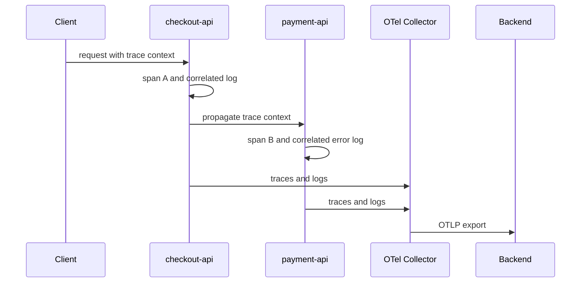

<p class="article-lead">A timestamp search can place logs near a trace, but it cannot prove that they belong to the same request. OpenTelemetry adds trace context and resource identity to the log record so correlation can be exact.</p>

## Quick read

- `TraceId` identifies the distributed request; `SpanId` identifies the operation that emitted the log.
- `Resource` describes the service instance or host that produced telemetry.
- `Timestamp` is source event time; `ObservedTimestamp` is when OpenTelemetry observed an external event.
- Use a logging bridge or context-aware appender so trace context is copied at emission time.
- Keep the Collector stateless where possible and verify that processors do not delete correlation fields.

## The LogRecord model

OpenTelemetry defines these main fields:

| Field | Purpose |
| --- | --- |
| `Timestamp` | Time the event occurred according to the source |
| `ObservedTimestamp` | Time the collection system observed it |
| `TraceId` | Distributed trace identifier |
| `SpanId` | Operation within the trace |
| `TraceFlags` | Trace context flags, including sampling state |
| `SeverityText` and `SeverityNumber` | Original and normalized severity |
| `Body` | Log payload |
| `Resource` | Entity producing telemetry, such as service and host |
| `InstrumentationScope` | Library or scope that emitted the record |
| `Attributes` | Additional typed event fields |

If `SpanId` is present, `TraceId` should also be present. A span ID without its trace is not globally useful.

## Correlation flow



The application must propagate context to service B. The logging integration must then read the active context when the log is created. Adding a random trace ID later in the Collector cannot reconstruct causality.

## A correlated record

Conceptual OTLP-style representation:

```json
{
  "timestamp": "2026-09-01T10:20:14.510Z",
  "observed_timestamp": "2026-09-01T10:20:14.514Z",
  "trace_id": "4bf92f3577b34da6a3ce929d0e0e4736",
  "span_id": "00f067aa0ba902b7",
  "severity_text": "ERROR",
  "body": "payment authorization failed",
  "resource": {
    "service.name": "payment-api",
    "service.instance.id": "payment-api-7f5d9c9f8b-px2lr",
    "deployment.environment.name": "production"
  },
  "attributes": {
    "payment.provider": "example-pay",
    "error.type": "authorization_declined"
  }
}
```

Do not place passwords, tokens, full payment data or arbitrary request bodies in attributes. Structured telemetry still needs a data-classification policy.

## Three integration patterns

| Pattern | How correlation is added | Trade-off |
| --- | --- | --- |
| Logging bridge/appender | Existing logger reads active OTel context | Usually best migration path |
| OpenTelemetry Logs API/SDK | Application emits LogRecords directly | Greater control, more application change |
| File or stdout collection | Collector parses existing text or JSON | Works for legacy apps; trace fields must already be in the record |

For legacy text logs, modify the logging layout to include `trace_id` and `span_id`, then parse them. A Collector can map fields into the OpenTelemetry model, but it cannot infer missing context from timestamp proximity reliably.

## Collector pipeline

```yaml
receivers:
  otlp:
    protocols:
      grpc: {}
      http: {}

processors:
  memory_limiter:
    check_interval: 1s
    limit_mib: 512
  batch: {}

exporters:
  otlp:
    endpoint: observability.example.net:4317
    tls:
      ca_file: /etc/otel/ca.pem

service:
  pipelines:
    logs:
      receivers: [otlp]
      processors: [memory_limiter, batch]
      exporters: [otlp]
    traces:
      receivers: [otlp]
      processors: [memory_limiter, batch]
      exporters: [otlp]
```

This is an architecture example, not a production sizing guide. Add authentication, retry and sending-queue settings supported by the chosen exporter, then load-test failure behaviour.

## Resource identity needs discipline

`service.name` should be stable across instances. `service.instance.id` should distinguish replicas. If every restart changes `service.name`, dashboards fragment. If every replica shares one `service.instance.id`, instance-level debugging becomes impossible.

Set common resource attributes at deployment or SDK initialization. Collector resource detection can add host or cloud attributes, but it should not overwrite a more authoritative application identity silently.

## Sampling creates an important caveat

Logs may carry a valid trace ID even when the trace was not retained. Head sampling can decide early not to record the trace; tail sampling may discard it later. The log remains useful for cross-service searching, but the trace-detail link may return nothing.

Track this explicitly. Do not advertise guaranteed log-to-trace navigation unless trace retention and sampling policy support it.

## Validate correlation

1. Send a request with a known W3C `traceparent` header.
2. Trigger logs in at least two services.
3. Confirm both logs share the 32-hex trace ID.
4. Confirm each log's span ID exists in the retained trace where expected.
5. Confirm service resource fields are present and correct.
6. Compare event and observed timestamps.
7. Repeat for an unsampled trace and document the user experience.

Also confirm that JSON conversion preserves 128-bit trace IDs as strings or bytes. Treating them as ordinary numbers can truncate precision.

## Sources and further reading

| External source | Purpose |
| --- | --- |
| [OpenTelemetry logging specification](https://opentelemetry.io/docs/specs/otel/logs/) | Log correlation model and collection approach |
| [Logs Data Model](https://opentelemetry.io/docs/specs/otel/logs/data-model/) | LogRecord field definitions |
| [Trace context in non-OTLP logs](https://opentelemetry.io/docs/specs/otel/compatibility/logging_trace_context/) | Recording trace fields in existing formats |
| [Collector receivers](https://opentelemetry.io/docs/collector/components/receiver/) | Supported ingestion components and maturity |

