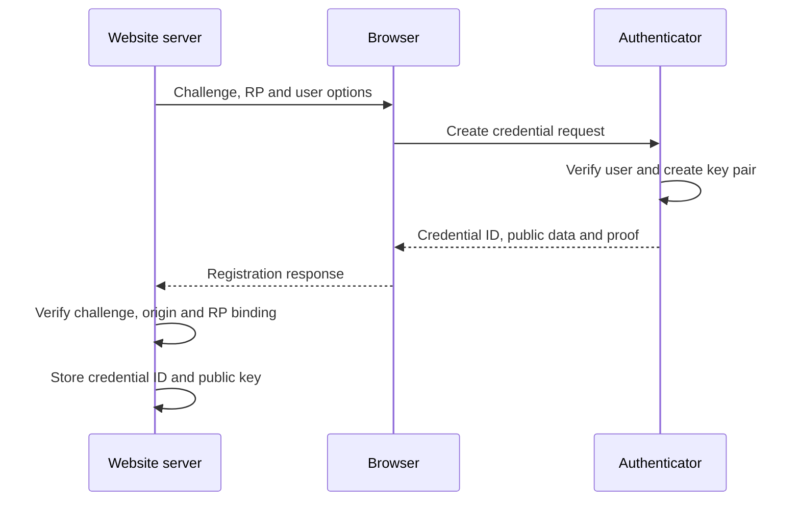

<p class="article-lead">A passkey is a public-key credential scoped to a website. The server stores a public key. The authenticator keeps the private key and signs a fresh challenge for each login.</p>

## Quick read

- A passkey is not a reusable password sent to a website.
- The private key stays under authenticator control. The website stores the public key and credential metadata.
- Every registration and login uses a fresh server challenge.
- The browser and authenticator bind the signature to the relying party and origin, which makes ordinary phishing substantially harder.
- Passkeys may be synced across a provider ecosystem or remain device-bound.
- Account recovery, device loss and active-session theft still need separate controls.

## Registration creates a key pair



The server begins with `navigator.credentials.create()` options. Important inputs include:

| Input | Purpose |
| --- | --- |
| `challenge` | One-time random value that prevents replay of an old registration |
| `rp.id` | Domain scope for the credential |
| `user.id` | Stable opaque user handle, not normally an email address |
| `pubKeyCredParams` | Public-key algorithms the server supports |
| `authenticatorSelection` | Preferences for discoverability, authenticator type and user verification |
| `excludeCredentials` | Existing credentials that should not be registered again |

The authenticator creates a credential key pair and returns an attestation object plus browser client data. Whether the server validates attestation as proof of authenticator model depends on policy. Many consumer services accept an untrusted or privacy-preserving attestation mode because they need a valid credential, not a hardware inventory.

## Authentication proves possession

During login, the server sends a new challenge through `navigator.credentials.get()`. The authenticator asks for an appropriate user gesture or verification, then signs data bound to that challenge and relying party.

The server verifies:

1. The response type is the expected WebAuthn operation.
2. The client-data challenge matches the outstanding one-time challenge.
3. The origin is explicitly allowed.
4. The authenticator data contains the expected relying-party ID hash.
5. Required user-presence and user-verification flags are set.
6. The signature verifies with the stored credential public key.
7. The challenge has not expired or already been used.

The [WebAuthn specification](https://www.w3.org/TR/webauthn-3/) defines the exact verification steps. Use a maintained server library rather than assembling CBOR, COSE and signature handling manually.

## What is stored where

| Location | Typical data |
| --- | --- |
| Authenticator or passkey provider | Credential private key and credential source metadata |
| Website database | Credential ID, public key, user association, signature counter and descriptive metadata |
| Browser transaction | Challenge, origin-bound client data and ceremony result |
| User session | Ordinary post-login application session, managed separately from the passkey |

A signed assertion is not a long-lived bearer token. Capturing one valid response should not permit another login because the next challenge differs.

## Why phishing resistance is stronger

Passwords can be typed into a convincing copy of a login page. A WebAuthn credential is scoped to a relying-party ID, and the browser supplies the real origin to the ceremony. An attacker at a lookalike domain cannot ask the authenticator to produce an assertion for the real site's relying party.

This does not make the entire account immune to phishing. Attackers may target:

- fallback passwords or weak recovery flows;
- an already authenticated browser session;
- malware controlling the endpoint;
- social engineering against support staff; or
- a passkey-provider account protected by weak recovery.

Passkeys improve the login cryptographic boundary. The application must secure the rest of the account lifecycle.

## Synced and device-bound credentials

| Model | Benefit | Operational caveat |
| --- | --- | --- |
| Synced passkey | Available across a user's compatible devices and easier to recover | Security also depends on the provider account, synchronization protection and recovery process |
| Device-bound passkey | Private credential material remains tied to one authenticator | Device loss requires another credential or recovery path |
| Roaming security key | Portable across computers without cloud synchronization | User must carry it and ideally register a spare |

WebAuthn describes authenticator and credential properties. Product interfaces may use the word passkey for several supported combinations. Do not infer device binding or synchronization merely from the label shown to the user.

## Design the account lifecycle before launch

Registration and login demonstrations are the easy part. A production design needs these paths:

| Lifecycle event | Required behaviour |
| --- | --- |
| Add another passkey | Require a recent strong authentication and notify the account owner |
| Name credentials | Let the user distinguish phone, laptop and security key entries |
| Revoke a lost credential | Remove server acceptance without affecting unrelated credentials |
| Replace all devices | Provide a deliberate recovery route with strong abuse controls |
| Change username or email | Keep the internal WebAuthn user handle stable |
| Delete account | Remove credential records and active sessions |
| Detect suspicious login | Revoke sessions and review recovery events, not only passkeys |

Registering at least two independent authenticators reduces dependence on the recovery desk. A passkey-only account without a tested recovery policy can be secure but operationally fragile.

## Server-side record shape

A minimal conceptual record looks like this:

```json
{
  "credential_id": "base64url-value",
  "user_id": "internal-user-id",
  "public_key": "stored-cose-public-key",
  "sign_count": 18,
  "transports": ["internal", "hybrid"],
  "created_at": "2026-09-13T09:30:00Z",
  "last_used_at": "2026-09-13T09:42:00Z",
  "display_name": "Work laptop"
}
```

The exact representation depends on the WebAuthn library. Credential IDs are binary values and should be stored without lossy text conversion. A signature counter can contribute to clone-risk detection, but synced authenticators may not provide a simple globally increasing counter. Do not reject users solely because the counter did not advance.

## Rollout checklist

1. Use HTTPS and a deliberate relying-party ID.
2. Generate unpredictable, single-use challenges with a short lifetime.
3. Verify origin, relying-party binding, flags and signatures on the server.
4. Store more than one credential per account.
5. Provide credential naming, last-used information and revocation.
6. Protect credential addition and recovery as high-risk operations.
7. Retain a carefully bounded fallback during migration.
8. Test cross-device authentication, device replacement and account recovery.

## Important references

| Reference | Use |
| --- | --- |
| [WebAuthn Level 3](https://www.w3.org/TR/webauthn-3/) | Registration, authentication and authenticator model |
| [WebAuthn Level 2 Recommendation](https://www.w3.org/TR/webauthn-2/) | Stable W3C recommendation |
| [FIDO Alliance passkeys](https://fidoalliance.org/passkeys/) | Deployment and ecosystem overview |
| [Credential Management API](https://www.w3.org/TR/credential-management-1/) | Browser credential interface context |
