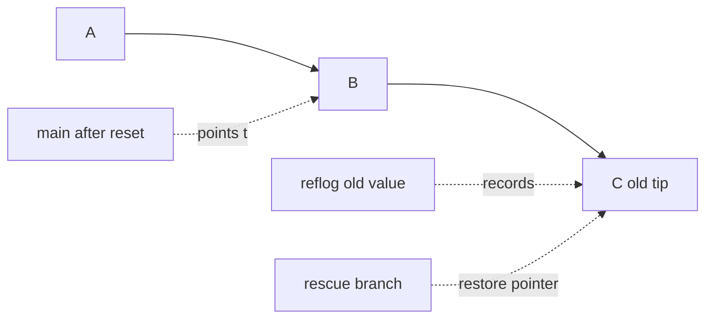

<p class="article-lead">A Git commit can disappear from the normal log without being deleted. A reset, rebase or branch deletion often moves a reference while the commit object remains recoverable through a reflog.</p>

## Quick read

- Stop rewriting history and do not run garbage collection while recovering.
- Use `git reflog` to find the previous value of `HEAD` or a branch.
- Inspect the candidate with `git show` before changing another reference.
- Create a rescue branch. Do not immediately reset the damaged branch again.
- `git fsck` is a fallback for unreachable objects that no reflog names.
- Git cannot recover work that was never committed, staged or otherwise stored as an object.

## Why a commit appears to vanish

Git stores content as objects. Branches and tags are references that point into the commit graph. Most history-changing commands create new commits or move references. They do not immediately erase the older objects.



The [Git data model](https://git-scm.com/docs/gitdatamodel) describes four core parts: objects, references, the index and reflogs. An object does not change after creation. Recovery is often the act of making a new reference point to an existing object before Git eventually prunes it.

## Use the safe recovery sequence

First record the current state without changing it:

```bash
git status
git branch --show-current
git rev-parse HEAD
git log --oneline --decorate -12
```

If the working tree contains valuable uncommitted files, copy them outside the repository before experimenting. A reflog protects reference history, not every version of an uncommitted file.

Next inspect recent reference movements:

```bash
git reflog --date=iso --decorate
```

Example:

```text
8c91a42 HEAD@{2026-09-13 09:04:11 +0100}: reset: moving to HEAD~2
f245dc7 HEAD@{2026-09-13 09:02:30 +0100}: commit: add recovery checklist
43af10b HEAD@{2026-09-13 08:58:09 +0100}: commit: add diagram
```

The commit of interest is likely `f245dc7`. Inspect it without checking it out:

```bash
git show --stat --oneline f245dc7
git show --name-status f245dc7
```

If it is correct, anchor it with a new branch:

```bash
git branch rescue/recovered-work f245dc7
git log --oneline --decorate rescue/recovered-work -5
```

Only after the work is safe should you decide whether to merge, cherry-pick or move the original branch.

## Choose the repair after creating the rescue branch

| Goal | Safer next action |
| --- | --- |
| Put one recovered change onto the current branch | `git cherry-pick f245dc7` |
| Preserve the recovered line of work | Keep or rename the rescue branch |
| Replace a local branch with the recovered tip | Verify collaborators and then use an explicit reset |
| Restore a deleted branch | Create a new branch at its last reflog commit |
| Inspect without changing branches | Use `git show HASH:path/to/file` |

Do not force-push merely because local recovery succeeded. A remote branch may have advanced independently. Fetch it and compare the graphs first:

```bash
git fetch origin
git log --oneline --left-right --graph HEAD...origin/main
```

## Find the right reflog

`git reflog` normally shows the `HEAD` reflog. A branch can have its own useful history:

```bash
git reflog show main
git reflog show --all --date=iso
```

| Accident | Useful evidence |
| --- | --- |
| `git reset --hard` | `HEAD` and branch reflogs before the reset |
| Rebase removed or rewrote commits | Entries immediately before `rebase (start)` |
| Commit amended by mistake | Previous `HEAD` before `commit (amend)` |
| Branch deleted | `HEAD` reflog from the last checkout or commit on that branch |
| Work committed in detached HEAD | `HEAD` reflog around checkout and commit entries |

Reflogs are local. They are not part of normal push, fetch or clone exchange. Another clone may nevertheless have a branch, remote-tracking reference or object that still reaches the commit.

## Use `fsck` when reflogs do not help

If no reflog names the commit, ask Git to inspect object connectivity:

```bash
git fsck --no-reflogs --unreachable
```

You may see:

```text
unreachable commit f245dc7...
unreachable tree 92bb771...
unreachable blob 23a031f...
```

Inspect candidate commits:

```bash
git show --stat f245dc7
git branch rescue/from-fsck f245dc7
```

`git fsck --lost-found` can write dangling commits and other objects under `.git/lost-found`, but it is less convenient than identifying a commit hash and creating a branch directly. The official [`git fsck` documentation](https://git-scm.com/docs/git-fsck) distinguishes unreachable objects from dangling objects.

## Know what may already be gone

Unreachable objects are not retained forever. Reflog expiry and garbage collection can eventually remove them. The timing depends on repository configuration and object state. Recovery chances decline if you run commands such as aggressive pruning before anchoring the commit.

The following data needs a different recovery route:

| Missing data | Why reflog may not help |
| --- | --- |
| Unsaved editor buffer | Git never received the content |
| Untracked file removed from disk | It was not stored in Git |
| Uncommitted file overwritten by `reset --hard` | No commit necessarily contains that exact version |
| Stash explicitly dropped | Its objects may be recoverable, but no ordinary reference names them |
| Commit pruned by garbage collection | The object is no longer in this object database |

Editor history, filesystem snapshots, backups, CI checkouts and colleagues' clones may still contain the missing data.

## A recovery checklist

1. Stop destructive history operations.
2. Preserve uncommitted files outside the repository.
3. Capture `status`, `HEAD`, the current log and the reflog.
4. Inspect candidate objects with `git show`.
5. Create a new rescue branch at the verified commit.
6. Compare local and remote history.
7. Choose merge, cherry-pick or a deliberate branch move.
8. Remove the rescue branch only after the final history is verified and backed up.

## Important references

| Reference | Use |
| --- | --- |
| [Git core data model](https://git-scm.com/docs/gitdatamodel) | Objects, references, index and reflogs |
| [`git reflog`](https://git-scm.com/docs/git-reflog) | Reference history and expiry controls |
| [`git fsck`](https://git-scm.com/docs/git-fsck) | Object connectivity and unreachable objects |
| [Git maintenance and data recovery](https://git-scm.com/book/en/v2/Git-Internals-Maintenance-and-Data-Recovery) | Worked recovery examples |

