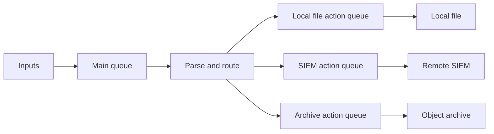

<p class="article-lead">A central logging outage should become a bounded backlog, not an immediate loss event or a host-wide logging stall. That requires a queue at the correct stage, enough spool capacity and a tested recovery rate.</p>

## Quick read

- Put a dedicated queue in front of a slow or remote action so one destination cannot block unrelated outputs.
- A disk-assisted queue normally uses memory first and creates spool files only under pressure or shutdown.
- Size the backlog in bytes and hours, not only in message count.
- Recovery must drain faster than new traffic arrives.
- Monitor queue age and disk capacity. A queue silently approaching its limit is deferred data loss.

## Where queues exist

rsyslog can queue at three scopes.

| Queue | Position | Useful for |
| --- | --- | --- |
| Main queue | After inputs | Absorbing bursts before the primary ruleset |
| Ruleset queue | Before one ruleset | Isolating a complete processing pipeline |
| Action queue | Before one output | Preventing one slow destination from blocking other actions |



The usual resilience pattern is a local file action and a remote forwarding action with independent queues. A failed SIEM then suspends only its action.

## Queue types are durability choices

| Type | Storage | Restart survival | Typical use |
| --- | --- | --- | --- |
| Direct | None | No | Fast synchronous local action |
| FixedArray or LinkedList | Memory | No, unless saved during clean shutdown | Burst absorption |
| Disk | Disk | Yes, subject to configuration and filesystem durability | Long or strict outages |
| Disk-assisted | Memory with disk spill | Spilled and saved data can survive | General remote forwarding |

A disk-assisted queue is not proof that every accepted event is already on persistent storage. Under normal load it intentionally keeps events in memory. If host-power-loss survival is mandatory, use a durability-oriented disk queue and test its checkpoint and sync behaviour. This costs throughput.

## Capacity is a time budget

Start with measured event rate and average serialized event size.

```text
backlog_bytes = events_per_second * average_bytes * outage_seconds
```

For 2,000 events per second, 900 bytes per serialized event and a four-hour outage:

```text
2,000 * 900 * 14,400 = 25,920,000,000 bytes
```

That is about 25.9 GB before filesystem overhead, queue metadata, bursts and safety margin. A 40 GB spool allocation would not be excessive for this example.

Message-size distributions matter. Stack traces and firewall batches can make a mean misleading. Use at least the observed 95th percentile and model the busiest hour, not the daily average.

## Recovery rate is equally important

If normal traffic is 2,000 events/s and the restored destination accepts only 2,100 events/s, the queue drains at 100 events/s. A four-hour backlog then takes approximately 80 hours to clear.

```text
net_drain_rate = destination_capacity - current_input_rate
drain_time = queued_events / net_drain_rate
```

The receiver, parser and index must all sustain the recovery rate. Increasing sender workers merely moves the bottleneck if the SIEM cannot ingest faster.

## An isolated forwarding action

```text
ruleset(name="ship_to_siem") {
  action(
    name="siem_relp"
    type="omrelp"
    target="siem.example.net"
    port="2514"
    queue.type="LinkedList"
    queue.filename="siem"
    queue.spoolDirectory="/var/spool/rsyslog"
    queue.size="500000"
    queue.highWatermark="400000"
    queue.lowWatermark="100000"
    queue.saveOnShutdown="on"
    action.resumeRetryCount="-1"
  )
}
```

The numbers are examples, not universal defaults. Queue size counts messages, while the spool filesystem is limited by bytes. Both constraints must be monitored.

`highWatermark` controls when a disk-assisted queue begins moving data toward disk. `lowWatermark` controls when it can return toward memory-oriented operation. Emergency or discard marks need explicit policy. Dropping debug events before audit events is reasonable only if classification happens before the queue and the loss policy is documented.

## Backpressure can travel upstream

When a queue reaches its limit, rsyslog must block, discard according to policy or fail the action. Blocking a local socket can eventually slow an application. UDP inputs cannot exert useful end-to-end backpressure and may lose packets before rsyslog can enqueue them.

This creates a capacity chain:

```text
application -> kernel socket -> rsyslog input -> queue -> network -> receiver -> parser -> index
```

The smallest finite buffer or slowest sustained stage sets the real limit.

## Monitor operational state

Enable rsyslog statistics and track at least:

| Signal | Meaning |
| --- | --- |
| Queue size | Current backlog count |
| Enqueued and dequeued rate | Whether backlog is growing or draining |
| Discard counters | Events lost due to policy or capacity |
| Action suspension and resume | Destination failure state |
| Oldest event age | Actual delivery delay experienced by users |
| Spool free bytes and inodes | Remaining outage budget |

Queue depth alone can be deceptive. Ten thousand large events may consume more disk than a million short events, while a small queue with a two-hour-old event may already violate the service objective.

## Run two outage tests

First test a clean receiver outage: stop the listener, generate numbered events, restore it and verify gaps and duplicates. Then test an unclean sender restart while events are queued. These exercises validate different guarantees.

Also test a malformed event and an authentication failure. Permanent failures should not retry forever while hiding the useful backlog behind an event that can never succeed.

## Sources and further reading

| External source | Purpose |
| --- | --- |
| [Rsyslog queue concepts](https://docs.rsyslog.com/doc/concepts/queues.html) | Main, ruleset and action queue architecture |
| [Reliable forwarding](https://docs.rsyslog.com/doc/tutorials/reliable_forwarding.html) | Disk-assisted buffering example and failure behaviour |
| [Pipeline design patterns](https://docs.rsyslog.com/doc/concepts/log_pipeline/design_patterns.html) | Fan-out and per-action isolation |
| [RELP output module](https://docs.rsyslog.com/doc/configuration/modules/omrelp.html) | Protocol-aware remote action |

