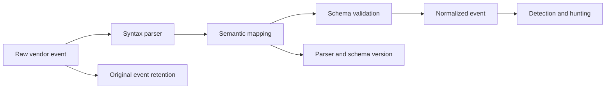

<p class="article-lead">A common schema is useful only when it lets one detection describe equivalent behaviour from different products. ECS, OCSF, Splunk CIM and Microsoft ASIM approach that goal at different layers.</p>

## Quick read

- ECS defines reusable fields and Elasticsearch-oriented data types for many event domains.
- OCSF defines implementation-agnostic security event classes, objects and required attributes.
- Splunk CIM supplies search-time data models, field names and tags used by Splunk content.
- ASIM supplies Microsoft Sentinel schemas plus query-time and ingest-time parsers.
- Choose from the detections and consumers you must support. Do not translate every field merely to claim compliance.

## The four approaches

| Model | Primary unit | Typical application point | Strong fit |
| --- | --- | --- | --- |
| ECS | Field sets and categorization fields | Ingested Elasticsearch document | Elastic search, observability and security content |
| OCSF | Event class composed from dictionary attributes and objects | Producer, lake or analytics interchange | Vendor-neutral security event representation |
| Splunk CIM | Data models, fields and event tags | Primarily search-time knowledge objects | Splunk apps, detections and accelerated data models |
| Microsoft ASIM | Schemas and unifying parsers | Query time and selected ingest-time tables | Microsoft Sentinel analytics and hunting |

This is not a ranking. An organisation may receive OCSF events, store an ECS-shaped copy and expose a Splunk CIM or ASIM view for a particular analytics system.

## Start with one semantic event

Raw vendor event:

```json
{
  "time": "2026-09-01T10:10:12Z",
  "eventId": 4625,
  "account": "alice",
  "src": "192.0.2.44",
  "result": "bad_password",
  "host": "dc-01"
}
```

A practical mapping exercise asks:

1. Is this an authentication attempt, not an account-management event?
2. Which actor and target identities exist?
3. Is `src` the connecting client, an observer or a translated address?
4. Does `bad_password` map to failure without losing the vendor reason?
5. Which stable source identifier prevents duplicate ingestion?

## Conceptual mapping

Exact fields depend on schema version and the selected event class or data model. This table shows the design direction, not a copy-paste mapping contract.

| Meaning | ECS | OCSF | Splunk CIM | ASIM |
| --- | --- | --- | --- | --- |
| Event domain | `event.category: authentication` | Authentication event class | Authentication data model and tags | Authentication schema |
| Outcome | `event.outcome: failure` | Status/activity fields defined by class | `action=failure` or model-compatible value | `EventResult=Failure` |
| User | `user.name` | User/account object | `user` | `TargetUsername` or actor/target field by semantics |
| Source address | `source.ip` | Source endpoint object | `src` | `SrcIpAddr` |
| Host reporting event | `host.name` | Device object | `dest` or host field by model | `DvcHostname` |
| Vendor event code | `event.code` | Source-specific or unmapped attribute where appropriate | Vendor/event-code field | `EventOriginalType` or schema field |

The dangerous shortcut is matching names without matching meaning. A field called `user` may be the subject, actor, target or session owner. Normalization should preserve roles.

## Keep the original and record the transform



Preserve enough provenance to answer:

- what the source actually sent;
- which parser version handled it;
- which schema and version were targeted;
- which values were inferred or defaulted; and
- which source fields had no mapping.

OCSF includes an `unmapped` concept. Other pipelines can keep vendor-specific namespaces or the original payload. Unmapped does not mean unimportant.

## Ingest-time or query-time normalization

| Choice | Advantages | Costs |
| --- | --- | --- |
| Ingest time | Faster repeated queries; type errors found early; stable indexed fields | Harder to repair historical data; processing and storage commitment |
| Query time | Raw event preserved; parser fixes apply to history; flexible experimentation | Repeated CPU cost; complex queries; inconsistent parser use |
| Hybrid | Common high-volume fields at ingest; long-tail fixes and aliases at query | Two layers need ownership and version tests |

Microsoft documents this trade-off directly for ASIM. Its query-time parsers preserve original tables and are easy to update, while ingest-time normalized tables improve large-query performance.

## Define a minimum viable schema

For an authentication detection, the useful contract might require:

- event time and ingest time;
- activity and outcome;
- source product and event code;
- actor and target user roles;
- source endpoint and target service;
- host or observer identity;
- authentication mechanism;
- failure reason without secrets; and
- stable original-event identifier.

Map optional enrichment only when a consumer uses it. Hundreds of mostly empty fields increase cost and make quality harder to measure.

## Test semantic quality

A pipeline is not compliant because the fields exist. Build fixtures that assert:

| Test | Example |
| --- | --- |
| Positive mapping | Failed password maps to authentication failure |
| Role correctness | Administrator resetting Alice is not recorded as Alice acting |
| Unknown value | New vendor outcome becomes unknown, not success |
| Type enforcement | IP address does not enter a free-text username field |
| Version change | Parser declares the schema version it emits |
| Detection equivalence | Same analytic finds equivalent events from two vendors |

The final test is the real objective. A normalized schema that cannot support cross-source analytics is only renamed data.

## Practical selection

Use the native model of the analytics product when you need its packaged detections and dashboards. Use OCSF when producers, storage and consumers need a vendor-neutral security contract. Use a small internal semantic layer only if it has clear owners, validation and translation tests.

Avoid translating ECS to OCSF to CIM to ASIM in a chain. Each conversion can lose roles and enumerations. Map from the source into the canonical model, then build tested projections for required consumers.

## Sources and further reading

| External source | Purpose |
| --- | --- |
| [Elastic Common Schema](https://www.elastic.co/docs/reference/ecs) | ECS scope, fields, types and custom-field policy |
| [OCSF schema repository](https://github.com/ocsf/ocsf-schema) | Event classes, objects, dictionary and schema source |
| [Understanding OCSF](https://github.com/ocsf/ocsf-docs/blob/main/overview/understanding-ocsf.md) | Composition and event-class requirements |
| [Splunk CIM overview](https://help.splunk.com/en/splunk-cloud-platform/common-information-model/6.3/introduction/overview-of-the-splunk-common-information-model) | Search-time data models, fields and tags |
| [Microsoft ASIM](https://learn.microsoft.com/en-us/azure/sentinel/normalization) | Schemas and unifying parsers |
| [ASIM ingest-time normalization](https://learn.microsoft.com/en-us/azure/sentinel/normalization-ingest-time) | Query-time and ingest-time trade-offs |

