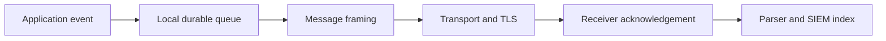

<p class="article-lead">Choosing TCP instead of UDP fixes only part of a syslog delivery problem. Framing, encryption, authentication, sender queues and application-level acknowledgement are separate design decisions.</p>

## Quick read

- UDP is simple and cheap, but the sender cannot determine whether the collector received an event.
- TCP detects a broken connection and provides ordered bytes, but syslog messages still need a framing method.
- TLS protects and authenticates a TCP connection. It does not prove that the receiving application committed an event.
- RELP adds a transaction response at the logging-protocol layer. A durable local queue is still required during an outage.
- No transport prevents every duplicate. Give important events stable identifiers and make ingestion idempotent where possible.

## Four different questions

The word **reliable** is too vague for logging architecture. Split it into four tests.

| Test | What must be answered |
| --- | --- |
| Framing | Where does one message end and the next begin? |
| Failure detection | Can the sender detect that the destination is unavailable? |
| Confidentiality and identity | Can an observer read events, and can each endpoint verify the other? |
| Application acknowledgement | Does the sender know that the remote logging endpoint accepted the event? |



The last arrow matters. A successful transport acknowledgement is not necessarily proof that the SIEM indexed the event. It may only show that an intermediate receiver accepted responsibility for it.

## Capability matrix

| Transport | Message boundary | Detect remote outage | Encryption | Protocol acknowledgement |
| --- | --- | --- | --- | --- |
| UDP syslog | One datagram normally carries one message | No dependable connection state | No | No |
| TCP syslog | Octet counting or delimiter-based framing | Yes, after the network stack detects failure | No | No |
| Syslog over TLS | TCP framing | Yes | Yes, with certificate validation | No |
| RELP | RELP transaction framing | Yes | Optional TLS | Yes, per transaction |

[RFC 6587](https://datatracker.ietf.org/doc/html/rfc6587) documents two TCP framing methods. **Octet counting** prefixes the message with its byte length. **Non-transparent framing** terminates a message with a character, commonly LF. A receiver configured for the wrong method can concatenate events or split a multiline event incorrectly even though the TCP connection itself is healthy.

Example octet-counted stream:

```text
56 <34>1 2026-09-01T09:15:00Z host app 42 ID47 - started
```

The decimal length is part of the transport frame, not part of the RFC5424 message.

## Why TCP is not end-to-end confirmation

TCP acknowledges bytes between operating-system network stacks. Consider this sequence:

1. A sender writes an event to an established socket.
2. The receiver's kernel acknowledges the bytes.
3. The receiver process terminates before it persists the event.
4. The sender has no syslog-level acknowledgement to distinguish this from success.

TCP remains much easier to buffer than UDP because a failed connection can suspend an rsyslog action. It still cannot report the final state of an Elasticsearch document, Splunk event or downstream data-lake object.

RELP narrows that gap. It uses commands, transaction numbers and responses so the sender knows whether the RELP peer accepted a transaction. The acknowledgement boundary is the RELP server. If that server forwards to another queue or SIEM, reliability beyond it needs a second design.

## TLS needs identity checks

Encrypting a connection without checking the peer name protects against passive inspection but may not protect against an active impostor. A production TLS setup needs:

- a trusted CA path;
- a certificate for each endpoint where mutual authentication is required;
- permitted peer names that match the intended collector;
- certificate-expiry monitoring; and
- an explicit policy for authentication failures.

[RFC 5425](https://datatracker.ietf.org/doc/html/rfc5425) defines the TLS transport mapping for syslog. RELP can also run over TLS, so RELP and TLS are complementary rather than competing choices.

## A durable RELP sender

This is a deliberately small rsyslog pattern. Paths, permissions, queue capacity, certificates and retry policy need site-specific review.

```text
module(load="omrelp")

action(
  name="central_relp"
  type="omrelp"
  target="logs.example.net"
  port="2514"
  tls="on"
  tls.caCert="/etc/rsyslog.d/ca.pem"
  tls.myCert="/etc/rsyslog.d/client.pem"
  tls.myPrivKey="/etc/rsyslog.d/client-key.pem"
  tls.authMode="name"
  tls.permittedPeer="logs.example.net"
  queue.type="LinkedList"
  queue.filename="central_relp"
  queue.spoolDirectory="/var/spool/rsyslog"
  queue.saveOnShutdown="on"
  action.resumeRetryCount="-1"
)
```

`queue.filename` gives the queue a disk-backed identity. It does not mean every event is synchronously written to disk before the application continues. Durability depends on queue mode, checkpoint and sync settings, shutdown behaviour and the durability of the filesystem.

## Test the failure path

A design is incomplete until an outage is exercised.

1. Send events containing a monotonic sequence number.
2. Stop or firewall the receiver.
3. Confirm the action is suspended and the queue grows.
4. Generate more events than the in-memory portion can hold.
5. Restart the sender unexpectedly if crash durability is a requirement.
6. Restore the receiver and verify sequence coverage.
7. Check duplicates separately from gaps.

Measure queue depth, oldest queued event age, rejected messages and free spool space. Alert before the queue is full, not after events are discarded.

## Practical choice

Use UDP only where loss is acceptable or where a device offers no better option. Use framed TCP with a sender queue for ordinary internal forwarding. Add TLS across untrusted or shared networks. Use RELP with durable queues for audit or security events when both endpoints support it.

That recommendation still has a boundary: no syslog transport alone provides exactly-once delivery into a final analytics index.

## Sources and further reading

| External source | Purpose |
| --- | --- |
| [RFC 6587](https://datatracker.ietf.org/doc/html/rfc6587) | TCP transport and framing methods |
| [RFC 5425](https://datatracker.ietf.org/doc/html/rfc5425) | TLS transport mapping for syslog |
| [rsyslog omrelp](https://docs.rsyslog.com/doc/configuration/modules/omrelp.html) | RELP sender and TLS parameters |
| [rsyslog reliable forwarding](https://docs.rsyslog.com/doc/tutorials/reliable_forwarding.html) | Sender queues and outage behaviour |

