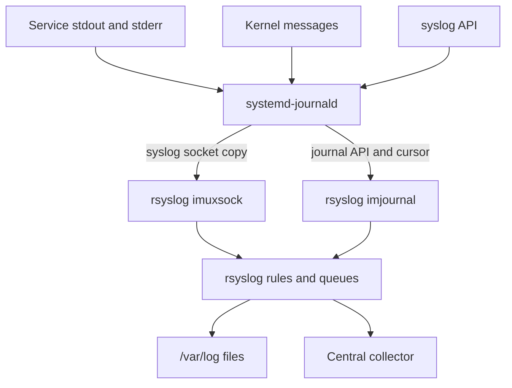

<p class="article-lead">On a systemd host, journald and rsyslog are usually different stages of the same logging path. journald captures local events and structured metadata. rsyslog adds text-file routing, transformation, queues and network delivery.</p>

## Quick read

- `Storage=auto` is persistent only when `/var/log/journal` exists; otherwise journal data is volatile.
- rsyslog can receive classic messages from journald's syslog socket or read stored journal records with `imjournal`.
- Socket input is lighter. `imjournal` exposes richer journal metadata and cursor state but costs more.
- journald rate limiting can discard events before rsyslog sees them.
- Verify the actual path on the host. Distribution defaults differ.

## The common data paths



Do not enable both rsyslog input paths without understanding the distribution's defaults. Doing so can duplicate the same local event.

## journald storage is not automatically persistent

`Storage=` accepts four important values.

| Value | Behaviour |
| --- | --- |
| `volatile` | Store below `/run/log/journal`; data is lost at reboot |
| `persistent` | Store below `/var/log/journal`, with early-boot fallback to `/run` |
| `auto` | Persistent if `/var/log/journal` exists, otherwise volatile |
| `none` | Do not store, although configured forwarding can still occur |

A useful check is:

```bash
journalctl --disk-usage
test -d /var/log/journal && echo persistent-directory-present
systemd-analyze cat-config systemd/journald.conf
```

`systemd-analyze cat-config` is more reliable than reading only `/etc/systemd/journald.conf` because vendor files and drop-ins can override it.

To create persistent storage on a host whose policy permits it:

```bash
sudo mkdir -p /var/log/journal
sudo systemd-tmpfiles --create --prefix /var/log/journal
sudo journalctl --flush
```

Confirm retention and disk limits before enabling persistence across a fleet.

## `imuxsock` and `imjournal` have different trade-offs

| Feature | `imuxsock` path | `imjournal` path |
| --- | --- | --- |
| Source | Traditional syslog socket | Journal database/API |
| Structured journal fields | Limited | Available |
| Late rsyslog start | Socket backlog is limited | Can resume from stored journal records |
| Cost | Lower | Higher journal-read overhead |
| State | Socket delivery | Journal cursor state file |

The rsyslog documentation recommends the socket route when classic syslog content is sufficient. Use `imjournal` when fields such as `_SYSTEMD_UNIT`, `_BOOT_ID`, container metadata or reliable cursor-based catch-up are actually required.

Example journal input:

```text
module(
  load="imjournal"
  StateFile="imjournal.state"
  PersistStateInterval="100"
)
```

State-file permissions and rsyslog's working directory must allow the cursor to be persisted. Losing the state can cause replay or gaps depending on journal retention and restart behaviour.

## Rate limiting happens early

journald applies per-service rate limiting with `RateLimitIntervalSec=` and `RateLimitBurst=`. Once a service exceeds the effective burst inside the interval, further events are dropped until the interval expires. rsyslog cannot recover events that journald discarded first.

```text
[Journal]
RateLimitIntervalSec=30s
RateLimitBurst=10000
```

Do not disable limits globally to fix one noisy application. Prefer fixing the loop or setting service-specific `LogRateLimitIntervalSec=` and `LogRateLimitBurst=` values. Monitor journal messages reporting suppressed records.

## Retention has two simultaneous limits

`SystemMaxUse=` caps journal consumption, while `SystemKeepFree=` reserves filesystem space. journald honours the smaller permitted use. It removes archived journal files, not the active file, so actual use may temporarily remain above a target.

Useful commands:

```bash
journalctl --disk-usage
journalctl --list-boots
journalctl --verify
journalctl --vacuum-time=30d --dry-run
```

Review a dry run before vacuuming on a production host. Retention may be part of an audit requirement.

## Diagnose a missing event systematically

1. Confirm the service emitted it: `journalctl -u service-name --since -10m`.
2. Display all fields: `journalctl -u service-name -o verbose -n 1`.
3. Check for suppression messages and the service's rate-limit settings.
4. Check rsyslog input statistics and service status.
5. Verify filters and templates before the forwarding action.
6. Check the remote action queue and suspension state.
7. Compare the source timestamp, journal receipt time and SIEM ingest time.

This establishes the first stage where the event disappears. Restarting both daemons may hide the evidence and create a second problem.

## Choose a clear ownership model

For a modern systemd fleet, a sensible pattern is:

- journald owns immediate local capture, boot-aware queries and bounded local retention;
- rsyslog owns compatibility files, filtering, durable remote queues and delivery;
- the central platform owns longer retention, search, detection and access control.

The exact split is less important than documenting it and monitoring every handoff.

## Sources and further reading

| External source | Purpose |
| --- | --- |
| [journald.conf](https://www.freedesktop.org/software/systemd/man/latest/journald.conf.html) | Storage, rate limits, retention and forwarding |
| [journalctl](https://www.freedesktop.org/software/systemd/man/latest/journalctl.html) | Query, field, boot and verification commands |
| [rsyslog imjournal](https://docs.rsyslog.com/doc/configuration/modules/imjournal.html) | Journal reader behaviour and performance trade-off |
| [rsyslog queues](https://docs.rsyslog.com/doc/concepts/queues.html) | Forwarding and buffering architecture |
