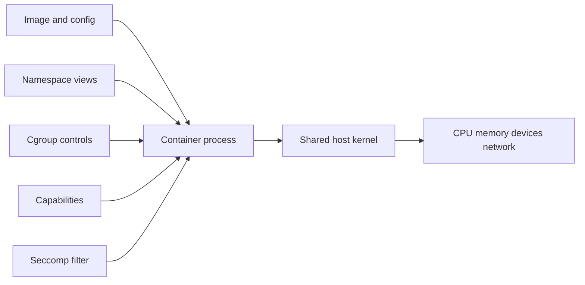

<p class="article-lead">A container is an isolated Linux process, not a small virtual machine. It has its own view of selected kernel resources, but it normally executes system calls against the host's kernel.</p>

## Quick read

- A virtual machine includes a guest kernel. A normal container shares the host kernel.
- Namespaces change what a process can see. Cgroups control or account for resources.
- Capabilities and seccomp reduce what a process can ask the kernel to do.
- An image supplies a filesystem and configuration. It does not supply a separate Linux kernel.
- Container isolation is useful, but a privileged container can weaken or remove much of it.

## The shortest useful comparison

| Property | Container | Virtual machine |
| --- | --- | --- |
| Workload | Host process with isolated views | Process inside a guest operating system |
| Kernel | Usually shared with host | Separate guest kernel |
| Startup | Process startup plus runtime setup | Boot guest operating system |
| Filesystem | Image layers plus writable layer | Virtual disk and guest filesystem |
| Resource control | Host cgroups and scheduler | Hypervisor allocation plus guest controls |
| Isolation boundary | Kernel features and runtime policy | Hypervisor and hardware-assisted virtualization |

This is a model, not a security ranking. A carefully configured container can provide strong workload isolation. A badly configured virtual machine or container can still be compromised.

## What `docker run` builds



The runtime performs several distinct jobs. Treating all of them as "the container" hides useful troubleshooting information.

| Mechanism | Practical effect |
| --- | --- |
| PID namespace | Gives the process a separate process-ID view. Its first visible process is normally PID 1. |
| Mount namespace | Gives it a separate mount table and filesystem view. |
| Network namespace | Gives it interfaces, routes, ports and firewall context separate from the host namespace. |
| UTS namespace | Separates hostname and domain-name values. |
| User namespace | Can map container user IDs to different host user IDs. This is not enabled in every setup. |
| Cgroup | Accounts for and constrains CPU, memory, process count and other resources. |
| Capability set | Splits traditional root authority into smaller privileges. |
| Seccomp policy | Filters system calls that the process may attempt. |

[Docker's security description](https://docs.docker.com/engine/security/) confirms that a normal container receives namespaces and cgroups when it starts. The exact defaults depend on the runtime, host and launch options.

## Prove that the kernel is shared

On a Linux Docker host, compare the kernel release outside and inside a container:

```bash
uname -r
docker run --rm alpine uname -r
```

The releases should match because both commands ask the same host kernel. The user-space files can still differ:

```bash
cat /etc/os-release
docker run --rm alpine cat /etc/os-release
```

The container reports Alpine because `/etc/os-release` comes from its image filesystem. That does not mean an Alpine kernel booted.

Now start a named container:

```bash
docker run --name namespace-demo --rm -d alpine sleep 600
docker exec namespace-demo sh -c 'echo "container PID: $$"; hostname; cat /proc/1/status | head'
docker inspect --format '{{.State.Pid}}' namespace-demo
```

The shell has a PID inside the container. `docker inspect` reports the corresponding host PID for the container's initial process. Both identify the same running task through different PID namespaces.

On the host, inspect its namespace handles:

```bash
pid=$(docker inspect --format '{{.State.Pid}}' namespace-demo)
readlink /proc/"$pid"/ns/pid
readlink /proc/"$pid"/ns/mnt
readlink /proc/"$pid"/ns/net
```

Each `/proc/PID/ns` entry identifies a kernel namespace associated with the process. Other processes can share some namespaces and not others. A container is therefore a configured set of isolation relationships, not one kernel object with a single container flag.

Remove the demonstration container when finished:

```bash
docker stop namespace-demo
```

## Namespaces do not impose resource limits

A memory namespace does not exist in the same sense as a PID namespace. Memory accounting and limits are handled through cgroups.

Inspect the runtime's recorded constraints:

```bash
docker run --name limited-demo --rm -d --memory 128m --cpus 0.5 alpine sleep 600
docker inspect --format '{{.HostConfig.Memory}} bytes, {{.HostConfig.NanoCpus}} NanoCPUs' limited-demo
docker stats --no-stream limited-demo
docker stop limited-demo
```

The memory value is a ceiling, not a reservation of physical RAM. CPU configuration usually controls how much scheduler time the cgroup may receive. The details depend on cgroup version and runtime configuration. The kernel's [cgroup v2 guide](https://docs.kernel.org/admin-guide/cgroup-v2.html) documents the controllers and their files.

## Root inside is still sensitive

Container root is not automatically equivalent to unrestricted host root, but it remains powerful. Docker normally removes many Linux capabilities and applies a default seccomp profile. Launch options can add them back.

```bash
docker run --rm alpine sh -c 'grep Cap /proc/1/status'
docker run --rm --cap-drop ALL alpine sh -c 'grep Cap /proc/1/status'
```

Avoid treating these options as harmless conveniences:

```text
--privileged
--pid=host
--network=host
--cap-add SYS_ADMIN
-v /:/host
```

They do different things, but each can weaken separation. Mounting the Docker socket is especially powerful because a process that controls the daemon can normally ask it to create highly privileged containers.

## A better troubleshooting model

When container behaviour is surprising, identify the layer first.

| Symptom | Inspect first |
| --- | --- |
| Process cannot see another process | PID namespace and `/proc` mount |
| Port works inside but not outside | Network namespace, published ports and host firewall |
| File exists in image but disappears | Mount namespace, bind mounts and volumes |
| Process is killed under load | Memory cgroup events and host kernel log |
| Root operation returns `EPERM` | Capability set, seccomp and security module policy |
| Host and container show the same kernel | Expected shared-kernel behaviour |

The useful question is not "is Docker broken?" It is "which kernel view, resource controller or security policy produced this result?"

## Important references

| Reference | Use |
| --- | --- |
| [Docker Engine security](https://docs.docker.com/engine/security/) | Runtime isolation and daemon security model |
| [Linux namespaces](https://man7.org/linux/man-pages/man7/namespaces.7.html) | Namespace types and relationships |
| [Linux cgroup v2](https://docs.kernel.org/admin-guide/cgroup-v2.html) | Resource controller behaviour |
| [Linux capabilities](https://man7.org/linux/man-pages/man7/capabilities.7.html) | Split root privileges |
| [Docker seccomp profile](https://docs.docker.com/engine/security/seccomp/) | Default system-call filtering |
