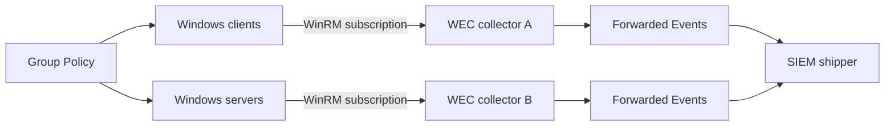

<p class="article-lead">Windows Event Forwarding can aggregate security events without deploying a separate agent for the forwarding step. Its reliability depends on subscription scope, client event-log retention, collector health and explicit monitoring.</p>

## Quick read

- Source-initiated subscriptions scale well because Group Policy defines which computers may enrol.
- Collector-initiated subscriptions suit a small fixed set of known machines.
- The collector stores a bookmark and heartbeat state for each source and subscription.
- A disconnected source can send backlog after reconnecting only while its local event log still retains those records.
- Monitor runtime status and source freshness. An empty Forwarded Events log is not proof of health.

## Architecture



WEF transports selected records using Windows Event Collector and WS-Management. The SIEM normally reads the collector's Forwarded Events channel or a custom destination log.

## Choose the subscription direction

| Model | Membership | Best fit | Main operational cost |
| --- | --- | --- | --- |
| Source-initiated | Clients enrol based on Group Policy and subscription ACL | Large or changing domain fleets | Group membership, certificate or Kerberos policy and collector capacity |
| Collector-initiated | Collector lists and contacts sources | Small fixed high-value set | Credentials and per-source configuration |

Source-initiated does not mean any computer can submit. Each subscription has an ACL containing allowed or denied machine accounts or machine security groups.

## Baseline and targeted subscriptions

Avoid one subscription containing every interesting event from every host.

| Subscription | Scope | Delivery preference |
| --- | --- | --- |
| Baseline | Common authentication, policy and service events across the fleet | Normal or bandwidth-efficient |
| Targeted | High-value hosts or high-priority security events | Minimize latency |
| Diagnostic | Temporarily increased provider or channel detail | Short-lived, capacity-limited |

The event query should select exact channels, providers and event IDs where possible. A broad `Level <= 3` filter can miss useful informational security records and collect large volumes of irrelevant application warnings.

## Bookmarks do not create infinite retention

The collector maintains a bookmark and last heartbeat for each event source in each subscription. After reconnection, it sends the bookmark position so the source can resume.

The source still owns the backlog. If a laptop is disconnected longer than the retention of its Security log, older records are overwritten before WEF can request them. Size source channels from peak event rate and maximum expected disconnection:

```text
required_log_bytes >= peak_bytes_per_hour * maximum_offline_hours * safety_factor
```

WEF is not a substitute for adequate local event-log sizing.

## Delivery modes trade latency for connections

Subscription configuration includes a configuration mode and delivery batching parameters. The practical choices are:

- **Normal:** balances latency and network use.
- **Minimize bandwidth:** batches more and uses longer intervals.
- **Minimize latency:** delivers quickly with higher connection and processing cost.
- **Custom:** exposes delivery and heartbeat values directly.

Use low latency only for a deliberately small event set. Applying it to every event on thousands of hosts can overload collectors without improving detection quality.

## Rendered text or events

WEF can send rendered text or the event representation expected to be rendered on the collector. Rendered text uses more bandwidth but avoids message-rendering problems when the collector lacks the provider metadata installed on the source.

Test actual downstream output before standardising. A SIEM needs stable provider, event ID, channel, computer, user identifiers and event data, not only a human message string.

## Configure and inspect the collector

Initial collector configuration:

```powershell
wecutil quick-config
wecutil enum-subscription
wecutil get-subscription "Baseline-Security" /format:xml
wecutil get-subscriptionruntimestatus "Baseline-Security"
```

Runtime status should be collected as telemetry. Track each source's last heartbeat or event, error code and subscription state. Also monitor:

- Windows Event Collector service state;
- WinRM listener and authentication failures;
- Forwarded Events write errors and channel size;
- collector CPU, memory and disk latency;
- SIEM shipper checkpoint and lag; and
- event age from source time to SIEM ingest time.

## Verify recovery

1. Send a distinctive test event from a client.
2. Record its source timestamp and EventRecordID.
3. Block the collector or disconnect the client.
4. Generate a numbered set of test events.
5. Reconnect after more than one heartbeat interval.
6. Confirm backlog arrival and bookmark progress.
7. Restart the collector and repeat.

Run the test near the maximum planned disconnection window. A five-minute test does not validate a roaming laptop that is offline for a week.

## Security boundary

Use Kerberos inside an appropriate domain trust or HTTPS with properly validated certificates where required. Limit subscription ACLs and collector administration. Forwarded logs contain credentials, hostnames, usernames, process data and potentially command lines, so access and retention require the same controls as the SIEM.

## Sources and further reading

| External source | Purpose |
| --- | --- |
| [Microsoft WEF guidance](https://learn.microsoft.com/en-us/windows/security/operating-system-security/device-management/use-windows-event-forwarding-to-assist-in-intrusion-detection) | Bookmarks, heartbeats, subscription patterns and recovery |
| [Windows Event Collector](https://learn.microsoft.com/en-us/windows/win32/wec/windows-event-collector) | Subscription architecture and types |
| [Source-initiated subscription setup](https://learn.microsoft.com/en-us/windows/win32/wec/setting-up-a-source-initiated-subscription) | Collector and source configuration |
| [wecutil](https://learn.microsoft.com/en-us/windows-server/administration/windows-commands/wecutil) | Subscription configuration and runtime-status commands |

