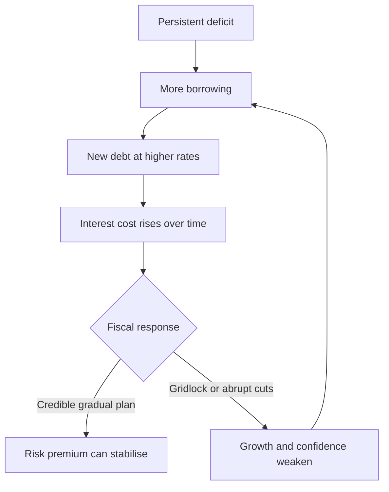

France's 10-year sovereign rate has risen from 3.75% in June to 4.90% in early October 2026. That is a serious repricing for a state with a large deficit and rising debt, but it is not the same as losing market access or approaching an automatic default.

> **Evidence cutoff: 6 October 2026.** The latest French 10-year reference rate available from Agence France Tresor is dated 2 October. Bond yields are live prices and will move after this article is published.

## Quick read

- France's official 10-year reference rate rose by about 115 basis points between 12 June and 2 October 2026.
- The move matters because the 2025 deficit was 5.1% of GDP and the European Commission expects debt to exceed 120% of GDP in 2027 under unchanged policies.
- France still has market access. It placed almost EUR 12 billion of long-term bonds on 1 October, with bids above the amounts sold.
- A higher French yield is not all France-specific risk. The OAT-Bund spread must be read alongside the absolute yield.
- ECB and ESM support tools exist, but they are discretionary, conditional and politically difficult. There is no automatic bailout.

The best description is **expensive market access under growing fiscal pressure**, not imminent insolvency.

## The repricing is real

The rise is large enough to change the discussion. In June, the Banque de France reported a 3.75% French 10-year yield. Agence France Tresor, or AFT, displayed a 4.90% TEC 10 rate for 2 October.

| Market measure | Latest official snapshot | Why it matters |
| --- | ---: | --- |
| French 10-year reference rate | 4.90% on 2 October 2026 | Marginal long-term borrowing has become much more expensive |
| French 10-year yield in the June stability report | 3.75% on 12 June 2026 | The increase between the two snapshots is about 115 basis points |
| Weighted average yield on 2026 OAT issuance | 3.55% at 30 September | The state's realised issuance cost is below the latest 10-year market rate, but is rising over time |
| Negotiable state debt outstanding | EUR 2.896 trillion at 30 September | Even a gradual increase in average interest cost becomes material on a large stock |
| Average life of negotiable debt | 8 years and 158 days | Higher rates feed into the budget gradually, not across the whole debt stock at once |
| Long-term OATs placed on 1 October | EUR 11.999 billion | France still completed a large auction; market access remains open |

There is one terminology trap. When yields rise, the market price of an existing fixed-coupon bond normally falls. The current warning is that **French bond yields have shot up**, not that existing bond prices have risen.

There is also a measurement trap. Comparing France's 10-year yield directly with US Treasuries or UK gilts mixes different currencies, inflation paths and central banks. The cleaner France-specific signal is the spread over a similar-maturity German Bund.

Nearby official quotes put France's TEC 10 at 4.90% on 2 October and the new German 10-year Bund near 3.63% on 29 September. That suggests a premium around 125 to 130 basis points, but it is only an approximation because the instruments and dates are not identical. It does not support presenting a precise 150-basis-point spread as a current official fact.

## France can still fund itself

A sovereign funding crisis is not defined by one high yield. The more urgent signals are failed auctions, sharply falling demand, very short debt maturities, or a state becoming unable to refinance without official assistance.

The 1 October AFT auction does not show that pattern. France sold four long-dated OAT lines with a combined issued amount of EUR 11.999 billion. Bids exceeded the amount served on every line.

That is not a clean bill of health. Investors can remain willing to lend if the yield is high enough. A successful auction shows access, while the 4.90% reference rate shows the price of that access.

## The fiscal arithmetic is uncomfortable

France entered this repricing with a weak fiscal baseline. Eurostat recorded a 2025 deficit of 5.1% of GDP and debt of 115.6% of GDP. The Commission's May forecast did not expect a quick improvement.

| Indicator | 2025 actual | 2026 forecast | 2027 forecast |
| --- | ---: | ---: | ---: |
| Real GDP growth | 0.8% | 0.8% | 1.1% |
| General government balance | -5.1% of GDP | -5.1% | -5.7% |
| Gross public debt | 115.6% of GDP | 118.1% | 120.2% |

The 2026 and 2027 figures are forecasts under unchanged policies, not completed outcomes. They still describe the core problem: weak growth, a large primary funding need and debt rising faster than the economy.

The higher market rate does not immediately apply to every outstanding bond. France's average debt maturity spreads refinancing over years. The pressure arrives through new deficits and maturing bonds that must be financed at current rates. This delay helps the Treasury, but it can also hide the eventual budget effect.

This is a feedback risk, not a forecast that the loop must accelerate. Tax changes, spending restraint, stronger growth, lower euro-area rates or improved political confidence can change the path.

## What "too big to fail" gets right

France was 15.8% of EU GDP in 2025 and was the EU's second-largest economy. Its government bonds are widely used by banks, insurers, funds and central-bank operations. Disorderly French funding stress would therefore be more than a national budget problem. It could affect collateral values, bank balance sheets and monetary-policy transmission across the euro area.

That scale creates a strong incentive for European institutions and governments to prevent a disorderly outcome. It does not create a legal guarantee for investors, and it does not decide which institution would act.

## What "too big to bail" gets right

The European Stability Mechanism has a EUR 500 billion lending capacity. That is substantial, but France's negotiable state debt alone was about EUR 2.9 trillion at the end of September. A rescue would not need to repay the entire debt stock, so comparing those two numbers does not prove that assistance is impossible. It does show why replacing France's normal market funding with one simple programme would be unrealistic.

France's size also changes the politics. Any support package would have to convince creditor governments, European institutions and French voters that its conditions were workable. The larger the programme, the harder those negotiations become.

The phrase is therefore useful only as shorthand:

- **Too big to fail:** a disorderly French default would threaten euro-area financial stability.
- **Too big to bail:** no existing tool offers a painless, unconditional substitute for France's own fiscal adjustment and normal market funding.

## The euro-area backstops are real but conditional

| Tool | What it can do | What it cannot promise |
| --- | --- | --- |
| French budget policy | Reduce future borrowing through revenue, spending and growth measures | Deliver a large adjustment without political or economic cost |
| EU excessive deficit procedure | Set a monitored multi-year correction path; France currently has a 2029 deadline | Provide cash or guarantee market demand |
| ECB Transmission Protection Instrument | Buy eligible sovereign securities when disorderly market dynamics threaten monetary transmission | Give France an automatic or unconditional right to purchases |
| ESM programme or credit line | Provide loans, precautionary credit or market support when euro-area stability is at risk | Replace all French market financing without conditions |
| Debt restructuring | Reduce or reschedule contractual debt in an extreme case | Avoid major losses, legal disputes and systemic contagion |

Two legal details matter.

First, Article 123 of the EU treaty prohibits central-bank credit to governments and **direct** central-bank purchases of their debt. It does not say that every secondary-market purchase is prohibited. ECB programmes still have to respect treaty safeguards and cannot be designed as disguised direct financing.

Second, TPI eligibility is not a one-line test. The ECB lists fiscal-framework compliance, absence of severe macroeconomic imbalances, fiscal sustainability and sound macroeconomic policies as cumulative inputs into the Governing Council's decision. France's excessive deficit procedure is relevant, but the ECB wording does not turn it into a simple automatic switch.

ESM help would also come with policy conditions and monitoring. That is why official support can solve a liquidity problem while creating a domestic political problem.

## What to watch next

| Signal | Reassuring development | Warning development |
| --- | --- | --- |
| OAT-Bund spread | Narrows or stabilises while euro-area yields move together | Widens sharply even when German yields are stable |
| AFT auctions | Healthy bid coverage across maturities | Weak demand, reduced placement or repeated yield concessions |
| 2027 budget path | Credible measures consistent with the EU expenditure path | Repeated slippage or measures that do not survive parliament |
| Deficit forecast | Clear movement toward 3% without a deep recession | Deficit remains near 5% while debt and interest costs rise |
| Debt-service pass-through | Average funding cost rises slowly and predictably | New issuance costs stay near 5% long enough to accelerate the interest bill |
| ECB and EU assessment | France is judged to be taking effective action | Institutions conclude that fiscal commitments are not being met |

The OAT-Bund spread is the most useful daily alarm, but the budget path is the more important medium-term test. A market can tolerate a high debt stock when it trusts the political system to stabilise it. It can reprice quickly when that trust weakens.

## Verdict

France's bond move is not noise. A rise of roughly 115 basis points in under four months materially worsens the cost of financing a large and still-rising debt burden.

But the strongest version of the crisis argument goes too far. France has not lost market access, Article 123 does not prohibit every form of secondary-market ECB action, and neither TPI nor ESM support follows automatically from a yield threshold.

"Too big to fail, too big to bail" captures the strategic bind. France is large enough that Europe would struggle to stand aside, and large enough that Europe cannot solve the problem without French fiscal choices, conditions and political consent.

## Important sources

| Source | Used for | Important limitation |
| --- | --- | --- |
| [Agence France Tresor](https://www.aft.gouv.fr/en) | 2 October TEC 10 rate, debt stock, maturity, average issuance yield and latest auction | Live page; market values change |
| [Banque de France financial stability report, June 2026](https://www.banque-france.fr/fr/publications-et-statistiques/publications/rapport-sur-la-stabilite-financiere-juin-2026) | 12 June yield baseline and interpretation of French risk premium | Predates the late-2026 jump |
| [Eurostat 2025 deficit and debt notification](https://ec.europa.eu/eurostat/web/products-euro-indicators/w/2-22042026-ap) | 2025 deficit and debt outturn | Next notification is due after this article's cutoff |
| [European Commission forecast for France](https://economy-finance.ec.europa.eu/economic-surveillance-eu-member-states/country-pages-including-country-reports/france/economic-forecast-france_en) | 2026-2027 growth, deficit and debt path | Forecast from 21 May 2026 |
| [EU Council excessive deficit recommendation](https://www.consilium.europa.eu/en/press/press-releases/2025/01/21/stability-and-growth-pact-council-adopts-recommendations-to-countries-under-excessive-deficit-procedure/) | France's 2029 correction deadline | Describes the required path, not the final budget outcome |
| [ECB Transmission Protection Instrument](https://www.ecb.europa.eu/press/pr/date/2022/html/ecb.pr220721~973e6e7273.en.html) | TPI purpose, eligibility and discretion | Activation remains a Governing Council decision |
| [TFEU Article 123](https://eur-lex.europa.eu/eli/treaty/tfeu_2012/art_123/oj/eng) | Direct monetary-financing prohibition | Must be read with case law and programme safeguards |
| [ESM lending toolkit](https://www.esm.europa.eu/financial-assistance/lending-toolkit) | Lending capacity, instruments and conditionality | Available instruments are not automatic entitlements |
| [German Finance Agency 2036 Bund factsheet](https://www.deutsche-finanzagentur.de/bundeswertpapiere/factsheet/isin/DE000BU2Z072) | Nearby German 10-year yield reference | Not the same instrument or observation date as French TEC 10 |
